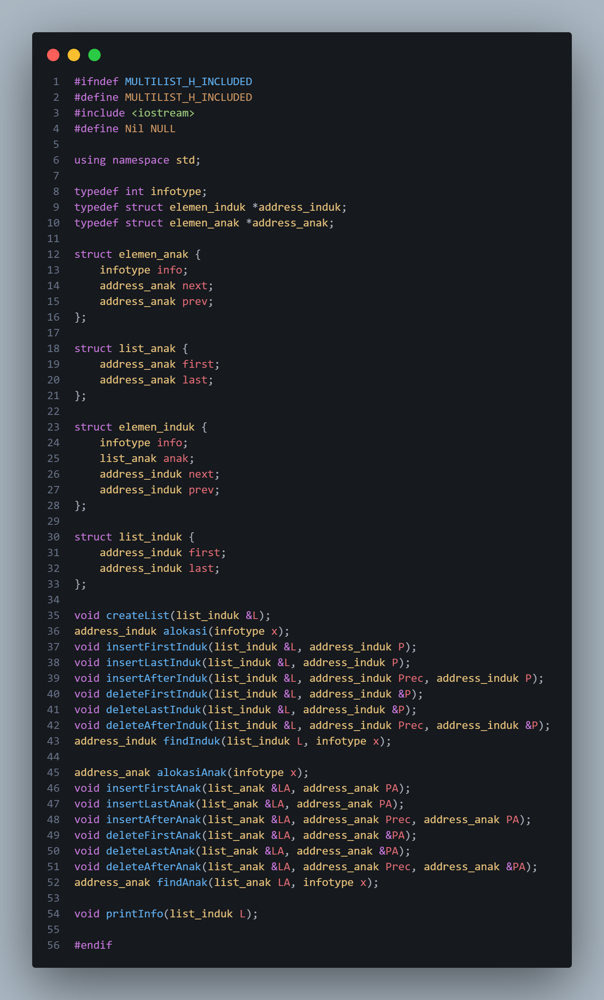
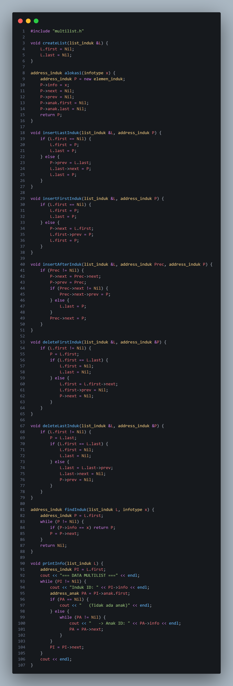
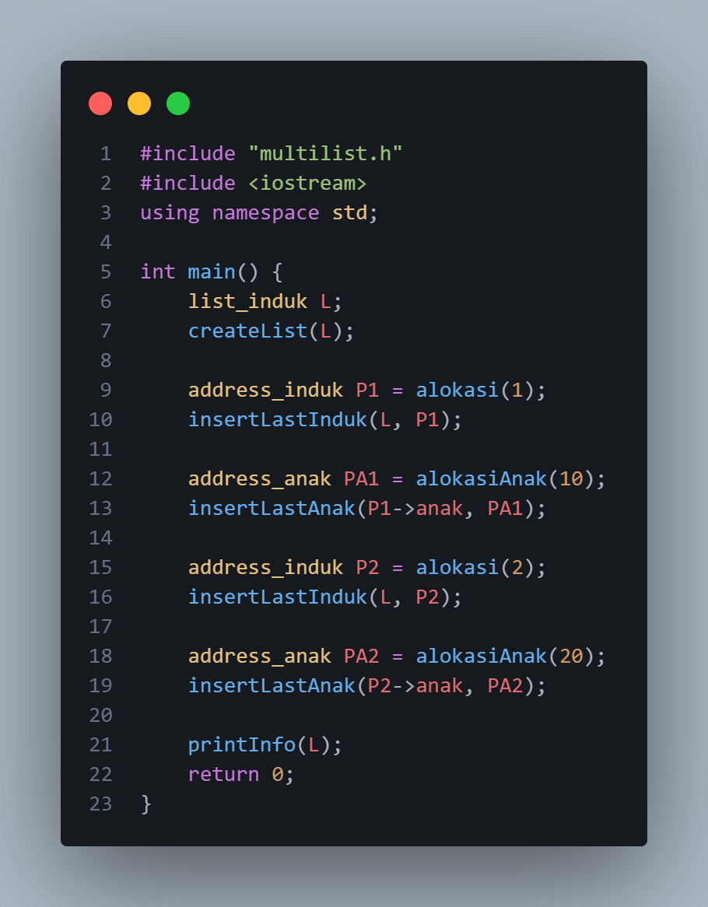
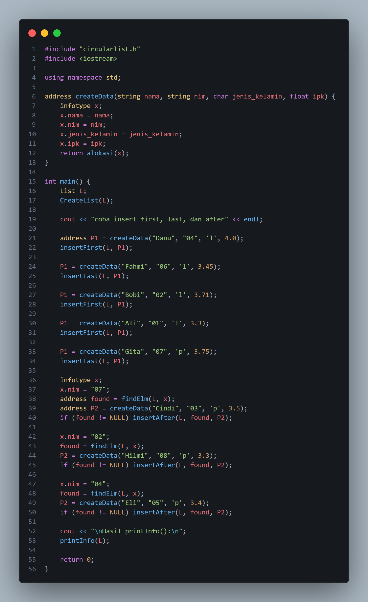

# Laporan Praktikum Struktur Data

## 1. Nama, NIM, Kelas
- **Nama**: Trisna Kusuma Ramadhany
- **NIM**: 103112400277
- **Kelas**: 12 IF 05

## 2. Motivasi Belajar Struktur Data
[saya termotovasi di struktur data karena melatih berpikir logis Selain itu, penguasaan struktur data juga menjadi bekal berharga untuk menghadapi tantangan dunia kerja, karena hampir semua perusahaan IT menguji kemampuan ini dalam seleksi.]

## 3. Dasar Teori
 Struktur data merupakan cara mengorganisasi dan menyimpan data dalam komputer sehingga dapat diakses dan dikelola secara efisien. Pemilihan struktur data yang tepat sangat penting karena menentukan kinerja program dalam melakukan operasi seperti pencarian, pengurutan, penyisipan, maupun penghapusan data. Dalam pemrograman modern, struktur data menjadi fondasi utama dalam merancang algoritma dan sistem yang efisien.

 Linked list memiliki beberapa bentuk, salah satunya adalah double linked list (DLL). Pada double linked list, setiap node memiliki dua pointer, yaitu pointer ke node berikutnya (next) dan pointer ke node sebelumnya (prev). Dengan adanya dua arah hubungan ini, proses penelusuran (traversal) dapat dilakukan maju maupun mundur, serta operasi penyisipan dan penghapusan node menjadi lebih efisien karena tidak perlu selalu mencari node sebelumnya. Namun, DLL membutuhkan memori lebih banyak dan penanganan pointer yang lebih hati-hati agar tidak terjadi kesalahan seperti broken link atau memory leak.
 
 Selain DLL, terdapat pula circular linked list di mana node terakhir akan menunjuk kembali ke node pertama, sehingga membentuk struktur melingkar. Circular linked list sering digunakan pada aplikasi yang memerlukan perputaran data secara berulang, seperti round robin scheduling. Dalam struktur ini tidak terdapat pointer yang berisi NULL, sehingga traversal dapat terus berulang sampai diberi kondisi berhenti.

konsep yang digunakan juga mencakup implementasi multilist, yaitu struktur data yang menyimpan lebih dari satu list dengan hubungan hierarkis. Multilist memungkinkan setiap node induk memiliki sublist anak, sehingga cocok untuk data yang bersifat one-to-many, seperti kategori dan item, fakultas dan jurusan, atau induk dan anak. Implementasi multilist biasanya melibatkan double linked list sebagai list induk dan list anak yang juga berbentuk linked list. Pointer memegang peran penting dalam multilist karena bertugas menghubungkan node induk dengan sublist anak dan menjaga integritas hubungan antar-node.

## 4. Guided
### 4.1 Guided 1

Penjelasan : Kode ini adalah kerangka dasar dari multilist dua tingkat yang memanfaatkan double linked list untuk fleksibilitas operasi insert dan delete. Setiap elemen induk memuat list anaknya sendiri, memungkinkan relasi satu–ke–banyak dalam struktur yang dinamis. Meski desainnya cukup modular dan terorganisasi, tanggung jawab menjaga integritas data sepenuhnya ada pada implementasi fungsi–fungsinya. Ada asumsi besar bahwa pointer selalu valid, list tidak rusak, dan penghapusaan induk tidak meninggalkan memory leak terhadap anak-anaknya. Struktur ini bekerja baik sebagai kerangka awal, tetapi untuk aplikasi sesungguhnya perlu ditambah pengamanan dan fungsi pengelolaan relasi yang lebih lengkap.

### 4.2 Guided 2

Penjelasan : Kode tersebut membangun sebuah multilist, yaitu struktur data yang berisi daftar induk (parent nodes), dan setiap induk memiliki daftar anak (child nodes) sendiri. Intinya, tiap elemen induk adalah node pada doubly linked list, dan di dalamnya ada list anak yang juga merupakan doubly linked list. Dengan demikian, setiap node induk bukan hanya menyimpan data dan pointer ke induk berikut/previous, tetapi juga sebuah sublist.Fungsi createList menginisialisasi list induk dengan mengosongkan pointer first dan last. Secara implisit kode ini mengasumsikan bahwa list kosong direpresentasikan hanya dengan kedua pointer bernilai NULL, tanpa adanya sentinel node; asumsi ini wajar, tetapi konsekuensinya setiap operasi list harus mengelola banyak kondisi khusus (empty list, one element, dsb). Desain ini benar secara umum, walaupun lebih rawan kesalahan bila dibandingkan dengan pendekatan sentinel.Fungsi alokasi membuat node induk baru, mengisi nilai datanya (info), serta menginisialisasi seluruh pointer baik untuk induknya maupun list anak di dalamnya. Kode ini mengasumsikan bahwa alokasi selalu berhasil (tidak pernah new gagal). Dalam program kecil mungkin tidak bermasalah, tapi dalam sistem yang lebih besar sebaiknya tetap dicek kemungkinan new mengembalikan null pointer.Fungsi-fungsi penyisipan (insertLastInduk, insertFirstInduk, dan insertAfterInduk) menangani penempatan node induk baru di berbagai posisi dalam list.

### 4.3 Guided 3

Penjelasan : Kode tersebut merupakan implementasi dari struktur data Double Linked List (Daftar Berantai Ganda) untuk entitas yang disebut "Anak". Secara keseluruhan, kode ini mengatur bagaimana sebuah elemen baru dibuat, dimasukkan ke dalam daftar, dan dihapus dari daftar dengan memanipulasi dua penunjuk utama, yaitu next (ke elemen setelahnya) dan prev (ke elemen sebelumnya).Pada bagian awal, terdapat fungsi alokasiAnak yang bertanggung jawab untuk memesan tempat di memori bagi data baru. Fungsi ini menginisialisasi sebuah elemen sehingga memiliki nilai data tertentu, namun belum terhubung ke mana pun (penunjuk next dan prev masih bernilai Nil). Ini adalah langkah wajib sebelum sebuah data bisa dimasukkan ke dalam struktur list yang lebih besar.Untuk penambahan data, terdapat dua fungsi yaitu insertFirstAnak dan insertLastAnak. Fungsi Insert First bekerja dengan cara menempatkan elemen baru di posisi paling depan; jika list sudah berisi data, elemen baru tersebut akan menjadi "kepala" baru dan terhubung dengan elemen yang sebelumnya ada di posisi pertama. Sementara itu, Insert Last menempatkan elemen baru di posisi paling belakang dengan memanfaatkan penunjuk LA.last, sehingga proses penambahan di akhir list dapat dilakukan dengan sangat cepat tanpa harus menelusuri seluruh isi list dari awal.Terakhir, bagian penghapusan dikelola oleh deleteFirstAnak dan deleteLastAnak. Kedua fungsi ini tidak hanya sekadar menghapus elemen, tetapi juga sangat teliti dalam menangani kondisi list. Jika list hanya memiliki satu elemen, fungsi akan mengosongkan list tersebut (set first dan last menjadi Nil). Jika elemennya banyak, fungsi akan memutuskan ikatan elemen yang dihapus dan menggeser penunjuk first atau last ke elemen tetangganya agar rantai data tidak terputus dan alamat elemen yang dihapus tetap tersimpan dalam variabel PA.

### 4.4 Guided 4

penjelasan: Program tersebut dimulai dengan menyertakan berkas header multilist.h serta pustaka iostream, kemudian membentuk sebuah objek list_induk bernama L yang langsung diinisialisasi melalui pemanggilan createList(L) sehingga pointer first dan last diarahkan ke NULL. Setelah struktur dasar list siap, program membuat elemen induk pertama dengan memanggil alokasi(1), yang menghasilkan sebuah node baru berisi nilai informasi 1 serta pointer next, prev, dan seluruh pointer anak yang masih kosong. Elemen induk ini kemudian ditempatkan di bagian akhir list induk menggunakan insertLastInduk(L, P1), yang berarti program menyambungkannya sebagai node terakhir dalam daftar induk. Setelah itu, program juga membuat sebuah elemen anak dengan memanggil alokasiAnak(10), yang membentuk node anak bernilai 10, lalu memasukkannya ke daftar anak milik induk pertama melalui insertLastAnak(P1->anak, PA1) sehingga anak tersebut terhubung pada struktur anak milik induk bernilai 1.Langkah berikutnya identik tetapi dilakukan untuk elemen induk kedua. Program membuat node induk baru dengan alokasi(2)membentuk elemen bernilai 2 kemudian menambahkannya ke bagian akhir list induk agar berada setelah induk pertama.

### Output

## 5. Unguided
### 5.1 Unguided 1

Penjelasan : Program ini mendefinisikan sebuah struktur multilist, yaitu daftar induk yang masing-masing dapat memiliki daftar anak. Pada fungsi main(), pertama dibuat sebuah list induk bernama L menggunakan createList(L), yang menginisialisasi pointer first dan last menjadi Nil. Setelah itu, dua node induk dibuat melalui alokasi(1) dan alokasi(2) lalu dimasukkan ke akhir list dengan insertLastInduk. Setiap node induk memiliki sublist anak, sehingga insertLastAnak dan insertFirstAnak digunakan untuk menambahkan elemen-elemen anak pada masing-masing induk. Untuk induk pertama, disisipkan anak bernilai 10 dan 11 di bagian akhir; untuk induk kedua, ditambahkan anak bernilai 20 di akhir dan 19 di awal sehingga urutannya menjadi 19 → 20. Kemudian printInfo(L) mencetak seluruh struktur list.Setelah itu program menghapus elemen anak terakhir dari induk pertama melalui deleteLastAnak(P1->anak, PDel), yang menyimpan alamat node yang dihapus ke PDel, lalu list dicetak lagi untuk melihat perubahannya. Program diakhiri dengan return 0.

output :

### 5.2 Unguided 2

#### Circular.h

Penjelasan : Struktur kode tersebut mendefinisikan sebuah Circular Linked List yang digunakan untuk menyimpan data bertipe mahasiswa. Tipe data infotype berisi empat atribut: nama, nim, jenis_kelamin, dan ipk, yang semuanya merepresentasikan informasi dasar mahasiswa. Setiap node dalam list diwakili oleh ElmList, yang memuat satu data info dan pointer next yang menunjukkan node berikutnya — dan karena ini adalah circular list, elemen terakhir akan menunjuk kembali ke elemen pertama. Struktur List hanya menyimpan satu pointer, yaitu First, yang menjadi penanda awal list. Fungsi-fungsi yang dideklarasikan mencakup operasi dasar: membuat list (CreateList), mengalokasikan dan menghapus node (alokasi, dealokasi), serta berbagai operasi penyisipan dan penghapusan node di awal, setelah suatu node tertentu, dan di akhir list. Terdapat juga fungsi pencarian (findElm) yang bertujuan menemukan elemen tertentu berdasarkan data mahasiswa yang dicari, dan fungsi printInfo untuk menampilkan seluruh isi list. Secara keseluruhan, header file ini menyusun kerangka lengkap untuk implementasi sebuah circular singly linked list dengan data mahasiswa sebagai elemen list

#### Circular.cpp

penjelasan: Kode ini mengimplementasikan Circular Singly Linked List yang menyimpan data mahasiswa dalam bentuk node bertipe ElmList. Struktur ini berbeda dari linked list biasa karena node terakhir selalu menunjuk kembali ke node pertama, sehingga membentuk lingkaran.Program dimulai dengan fungsi CreateList yang menginisialisasi list kosong dengan menetapkan First = NULL. Fungsi alokasi membuat node baru berisi data mahasiswa, sementara dealokasi memastikan memori dilepas dengan aman. Tindakan ini terlihat standar, tetapi perhatikan bahwa dealokasi tidak mengecek apakah node itu bagian dari list jadi kalau dipakai sembarangan bisa memutus lingkaran secara tidak disengaja.Operasi penyisipan (insertFirst, insertAfter, insertLast) menjaga sifat melingkar list. Pada insertFirst, jika list kosong, node pertama menunjuk dirinya sendiri. Jika tidak, fungsi harus mencari node terakhir untuk menghubungkan node baru ke awal list tanpa merusak referensi circular. Di sini asumsi bahwa pencarian last selalu berhasil, tetapi jika ada node rusak (misal pointer nex-nya tidak valid), fungsi akan looping tanpa hentiini risiko alami struktur circular.Operasi penghapusan (deleteFirst, deleteAfter, deleteLast) juga mempertahankan struktur lingkaran. Pada deleteFirst, ketika hanya ada satu node, list dikosongkan; ketika node lebih dari satu, pointer last diperbarui agar menautkan kembali ke node pertama yang baru. Potensi kerentanan muncul pada deleteAfter, karena fungsinya mengizinkan kondisi ketika Prec->next == Prec, sesuatu yang di list circular normal tidak terjadi kecuali list berisi satu elemen.
#### unguided2.cpp

pemjelasan: Program ini membangun dan mengelola circular linked list berisi data mahasiswa. Proses dimulai dari pembuatan list kosong melalui CreateList(L), yang menginisialisasi pointer First menjadi NULL. Fungsi createData() digunakan sebagai pembungkus untuk mempermudah pembuatan node baru dengan mengisi struktur infotype lalu mengalokasikannya menggunakan alokasi(x). Setelah list siap, program memasukkan sejumlah elemen menggunakan kombinasi insertFirst, insertLast, dan insertAfter, sehingga urutan elemen terbentuk berdasarkan titik penyisipannya. Data seperti Danu, Fahmi, Bobi, dan Ali ditempatkan di awal atau akhir list sesuai pemanggilannya, sedangkan beberapa elemen lain seperti Cindi, Hilmi, dan Eli dimasukkan setelah node tertentu yang dicari lewat findElm. Pencarian dilakukan dengan mencocokkan field nim terhadap data yang dicari. Setelah seluruh operasi selesai, fungsi printInfo(L) dipanggil untuk menampilkan seluruh elemen list dalam bentuk melingkar mulai dari node pertama hingga kembali ke awal. Keseluruhan alur menunjukkan proses konstruksi dan manipulasi struktur circular linked list melalui operasi dasar insert dan search.

output:

## 6. Kesimpulan
Berdasarkan hasil praktikum yang telah dilakukan, dapat disimpulkan bahwa penggunaan struktur data dinamis seperti Double Linked List, Circular Linked List, dan Multilist memberikan pemahaman yang lebih mendalam mengenai cara kerja linked list dan pengelolaan data secara fleksibel. Melalui serangkaian percobaan guided dan unguided, seluruh operasi dasar seperti penyisipan, penghapusan, pencarian, serta penelusuran data dapat diimplementasikan dengan benar pada berbagai variasi linked list. Implementasi Double Linked List menunjukkan kemampuan untuk melakukan traversal dua arah dan mempermudah manipulasi node, sementara Circular Linked List memperlihatkan bagaimana sebuah list dapat membentuk siklus tanpa titik akhir. Selain itu, penerapan Multilist berhasil menggambarkan bagaimana struktur data dapat membentuk hubungan hierarkis antara node induk dan node anak. Praktikum ini secara keseluruhan mempertegas pentingnya pointer sebagai penghubung antar-node, serta menekankan perlunya ketelitian dalam pengaturan memori dan relasi data agar struktur tetap konsisten.
## 7. Referensi
1. GeeksforGeeks. “C++ Programming Language.” https://www.geeksforgeeks.org/c-plus-plus/
2. W3Schools. “C++ Tutorial.” https://www.w3schools.com/cpp/