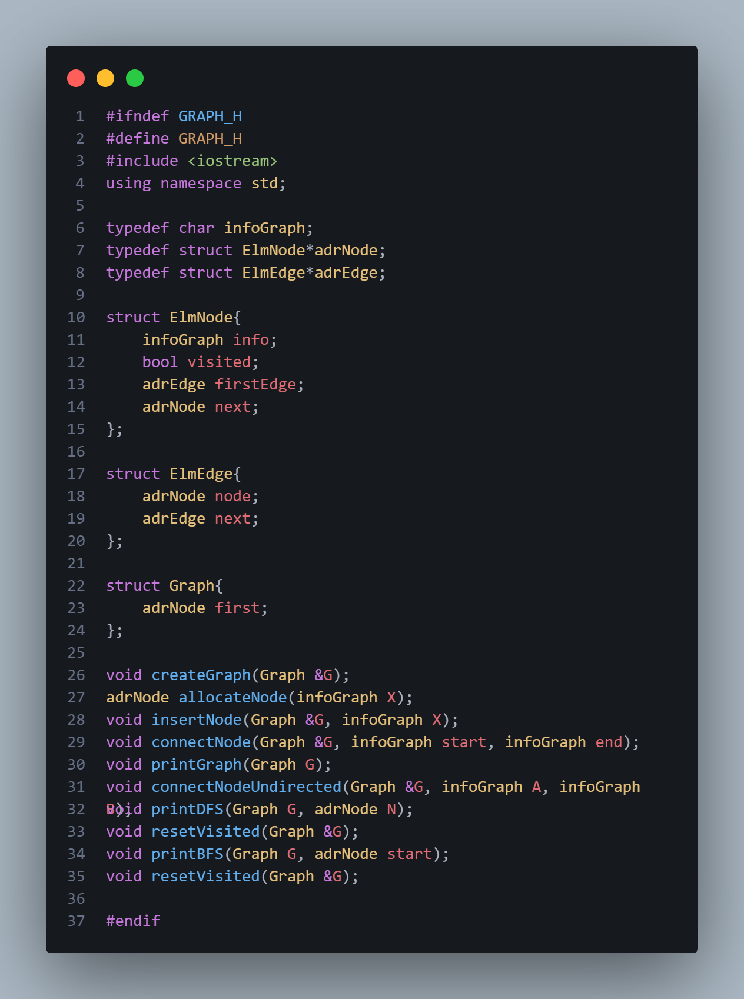
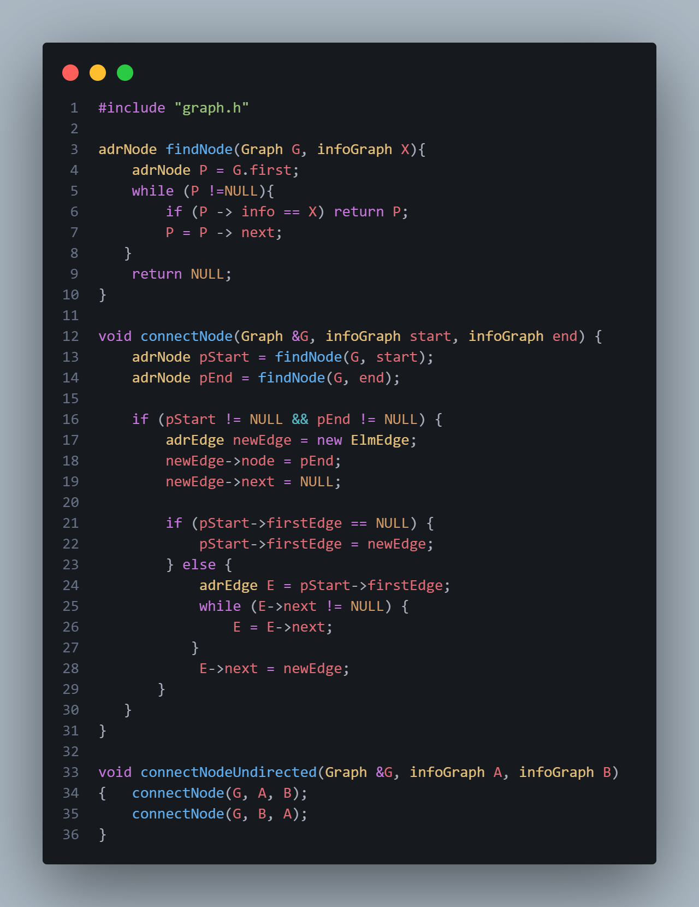
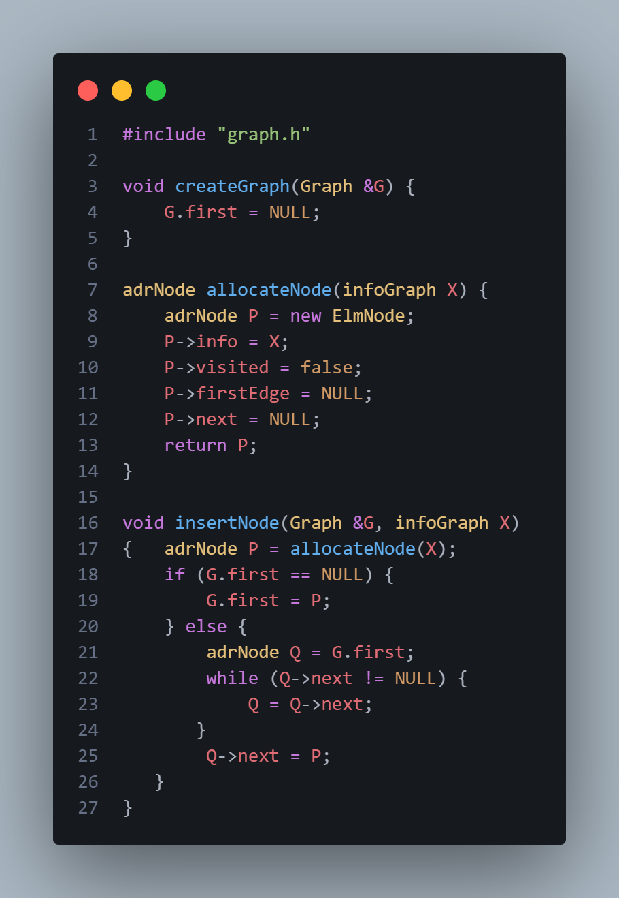
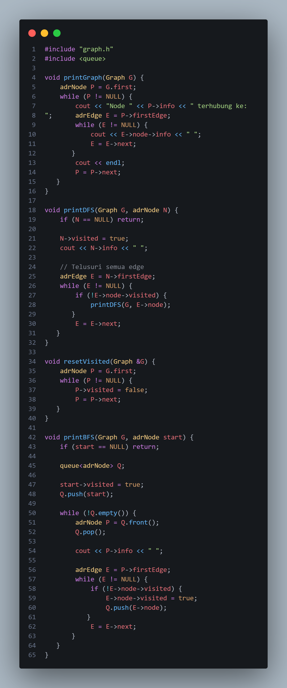
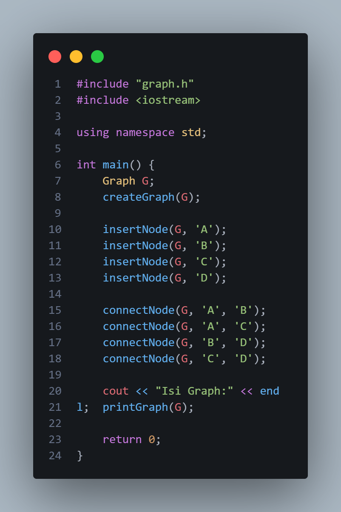
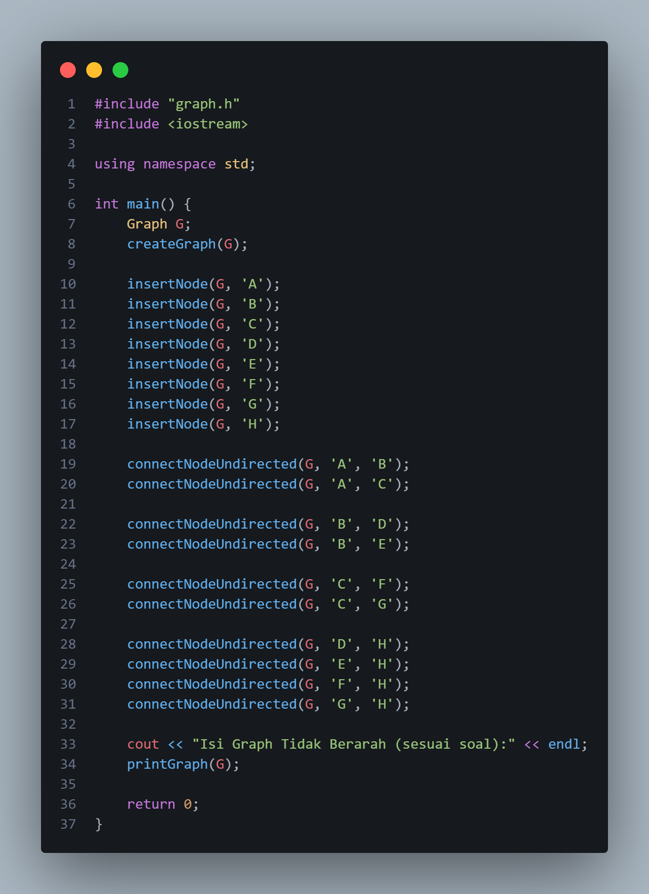
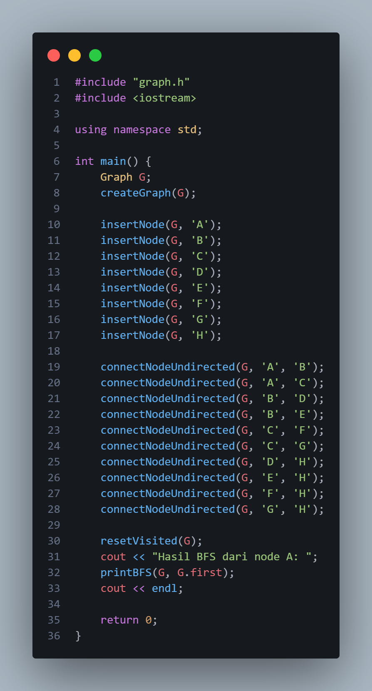

# Laporan Praktikum Struktur Data

## 1. Nama, NIM, Kelas
- **Nama**: Trisna Kusuma Ramadhany
- **NIM**: 103112400277
- **Kelas**: 12 IF 05

## 2. Motivasi Belajar Struktur Data
[saya termotovasi di struktur data karena melatih berpikir logis Selain itu, penguasaan struktur data juga menjadi bekal berharga untuk menghadapi tantangan dunia kerja, karena hampir semua perusahaan IT menguji kemampuan ini dalam seleksi.]

## 3. Dasar Teori
Struktur data merupakan konsep fundamental dalam ilmu komputer yang berfungsi untuk mengorganisasi, menyimpan, dan mengelola data di dalam memori komputer secara efisien. Pemilihan struktur data yang tepat sangat berpengaruh terhadap kinerja suatu program, terutama dalam menjalankan operasi dasar seperti penyisipan, penghapusan, pencarian, dan penelusuran data. Oleh karena itu, pemahaman struktur data menjadi landasan penting dalam perancangan algoritma dan pengembangan perangkat lunak yang efektif dan optimal.

Linked list merupakan salah satu struktur data dinamis yang banyak digunakan dalam pemrograman. Struktur ini tersusun atas node-node yang saling terhubung melalui pointer. Setiap node menyimpan data dan alamat node lain sebagai penghubung. Dibandingkan dengan array, linked list memiliki keunggulan dalam hal fleksibilitas alokasi memori. Salah satu pengembangan dari linked list adalah Double Linked List (DLL), di mana setiap node memiliki dua pointer, yaitu pointer ke node sebelumnya (prev) dan pointer ke node berikutnya (next). Struktur ini memungkinkan traversal dua arah serta mempermudah proses penyisipan dan penghapusan node, meskipun membutuhkan penggunaan memori yang lebih besar dan pengelolaan pointer yang lebih kompleks.

Selain itu, terdapat Circular Linked List, yaitu struktur linked list di mana node terakhir terhubung kembali ke node pertama sehingga membentuk suatu siklus. Pada circular linked list tidak terdapat pointer bernilai NULL, sehingga proses penelusuran data dapat dilakukan secara berulang hingga kondisi tertentu terpenuhi. Struktur ini banyak digunakan pada aplikasi yang memerlukan pengolahan data secara berulang dan berkesinambungan, seperti sistem penjadwalan berbasis round-robin.

Struktur data Graph (graf) merupakan struktur data non-linear yang digunakan untuk merepresentasikan hubungan atau keterkaitan antar objek. Graph terdiri dari kumpulan simpul (vertex atau node) dan sisi (edge) yang menghubungkan antar simpul tersebut. Graph dapat bersifat berarah (directed graph) maupun tidak berarah (undirected graph), tergantung pada arah hubungan antar simpul. Selain itu, graph juga dapat memiliki bobot (weighted graph) atau tidak berbobot (unweighted graph). Struktur data graph banyak digunakan dalam berbagai aplikasi, seperti pemodelan jaringan komputer, sistem navigasi, media sosial, dan pemetaan hubungan antar data.

Salah satu metode representasi graph yang umum digunakan adalah adjacency list, di mana setiap simpul memiliki daftar sisi yang menunjukkan simpul-simpul lain yang terhubung dengannya. Representasi adjacency list lebih efisien dalam penggunaan memori dibandingkan adjacency matrix, terutama untuk graph yang memiliki jumlah sisi relatif sedikit. Dalam implementasinya, adjacency list sering dibangun menggunakan linked list, sehingga setiap node graph memiliki linked list tersendiri untuk menyimpan edge yang terhubung dengannya.

Selain representasi, graph juga mendukung berbagai algoritma penelusuran, di antaranya Depth First Search (DFS) dan Breadth First Search (BFS). DFS melakukan penelusuran secara mendalam dari satu simpul ke simpul lain hingga mencapai simpul terdalam sebelum kembali (backtracking), sedangkan BFS melakukan penelusuran secara melebar dengan mengunjungi semua simpul tetangga pada satu level sebelum melanjutkan ke level berikutnya. Kedua algoritma ini sangat penting dalam proses pencarian jalur, deteksi keterhubungan, dan analisis struktur graph.Sebagai pengembangan lebih lanjut, konsep Multilist juga diterapkan dalam implementasi graph, khususnya pada representasi adjacency list. Multilist memungkinkan satu simpul induk memiliki sublist yang berisi simpul-simpul tujuan yang terhubung dengannya. Struktur ini sangat efektif dalam merepresentasikan hubungan one-to-many dan menjaga keterkaitan antar simpul dalam graph. Peran pointer dalam multilist menjadi sangat krusial untuk menjaga integritas hubungan antar-node serta memastikan struktur graph tetap konsisten selama proses manipulasi data.

## 4. Guided
### 4.1 Guided 1

Penjelasan : Kode tersebut merupakan file header C++ (.h) yang digunakan untuk mendefinisikan struktur data Graph (graf) beserta operasi-operasi dasarnya menggunakan linked list. Secara umum, graf direpresentasikan dengan daftar simpul (node), dan setiap simpul memiliki daftar sisi (edge) yang terhubung dengannya (adjacency list).Pada bagian awal kode, terdapat header guard dengan #ifndef GRAPH_H, #define GRAPH_H, dan #endif. Ini berfungsi untuk mencegah file header ini di-include lebih dari satu kali yang dapat menyebabkan konflik definisi. Selanjutnya, library <iostream> disertakan untuk keperluan input-output, dan using namespace std; digunakan agar tidak perlu menuliskan std:: setiap kali menggunakan fitur dari standard library.
Kemudian didefinisikan beberapa typedef untuk mempermudah penulisan tipe data. infoGraph didefinisikan sebagai char, yang berarti setiap node dalam graf menyimpan sebuah karakter sebagai informasi. adrNode dan adrEdge masing-masing merupakan pointer ke struktur ElmNode dan ElmEdge, sehingga memudahkan dalam pengelolaan alamat node dan edge.Struktur ElmNode merepresentasikan sebuah simpul (node) dalam graf. Di dalamnya terdapat info untuk menyimpan data node, visited bertipe boolean yang digunakan untuk menandai apakah node sudah dikunjungi (penting untuk DFS dan BFS), firstEdge yang menunjuk ke edge pertama dari node tersebut, serta next yang menunjuk ke node berikutnya dalam daftar node graf.Struktur ElmEdge merepresentasikan sisi (edge) yang menghubungkan satu node ke node lain. Variabel node menyimpan alamat node tujuan yang terhubung, sedangkan next menunjuk ke edge berikutnya dalam daftar edge milik suatu node. Dengan struktur ini, setiap node dapat memiliki banyak edgeStruktur Graph sendiri hanya memiliki satu elemen, yaitu first, yang menunjuk ke node pertama dalam graf. Ini menandakan bahwa graf disimpan sebagai linked list node, di mana setiap node memiliki linked list edge-nya sendiri.

### 4.2 Guided 2

Penjelasan : Kode tersebut digunakan untuk mengelola graf dengan representasi adjacency list. Fungsi findNode berperan mencari node dalam graf berdasarkan nilai informasinya dengan menelusuri linked list node dan mengembalikan alamat node jika ditemukan. Fungsi connectNode menghubungkan dua node secara searah dengan membuat edge baru dari node awal ke node tujuan dan menambahkannya ke daftar edge node awal. Sementara itu, fungsi connectNodeUndirected membuat hubungan dua arah dengan memanggil connectNode dua kali sehingga kedua node saling terhubung.

### 4.3 Guided 3

Penjelasan : kode tersebut memiliki beberapa fungsi yaitu Fungsi createGraph(Graph &G) digunakan untuk menginisialisasi graph dengan mengatur pointer first menjadi NULL, menandakan bahwa graph masih kosong dan belum memiliki node. Fungsi allocateNode(infoGraph X) berfungsi untuk membuat node baru secara dinamis, mengisi data node (info), mengatur status visited menjadi false, serta menginisialisasi pointer firstEdge dan next ke NULL. Node yang telah dibuat kemudian dikembalikan.
Selanjutnya, fungsi insertNode(Graph &G, infoGraph X) digunakan untuk menambahkan node ke dalam graph. Jika graph masih kosong, node baru langsung dijadikan sebagai node pertama. Jika graph sudah memiliki node, maka program akan menelusuri linked list hingga node terakhir, lalu menambahkan node baru di bagian akhir. Dengan demikian, kode ini mengatur pembuatan graph dan penambahan simpul (node) secara berurutan menggunakan struktur linked list.

### 4.4 Guided 4

penjelasan: Kode tersebut merupakan implementasi struktur graf berbasis adjacency list dalam C++ beserta beberapa operasi penelusuran. Fungsi printGraph digunakan untuk menampilkan setiap node dalam graf dan daftar node lain yang terhubung dengannya melalui edge. Fungsi printDFS melakukan penelusuran graf menggunakan Depth First Search (DFS) secara rekursif, dengan menandai node yang sudah dikunjungi agar tidak diproses berulang. Fungsi resetVisited berfungsi untuk mengatur ulang status visited semua node menjadi false, sehingga graf dapat ditelusuri kembali dari awal. Sementara itu, fungsi printBFS melakukan penelusuran graf menggunakan Breadth First Search (BFS) dengan bantuan struktur data queue, dimulai dari node awal (start) dan mengunjungi node tetangga secara bertahap berdasarkan urutan level.

### 4.4 Guided 5

penjelasan: kode tersebut menggunakan struktur data graph melalui pustaka graph.h. Di dalam fungsi main, program pertama-tama membuat sebuah objek graph G lalu menginisialisasinya dengan createGraph(G). Setelah itu, empat simpul (node) dengan label 'A', 'B', 'C', dan 'D' ditambahkan ke dalam graph menggunakan insertNode. Selanjutnya, hubungan (edge) antar simpul dibuat dengan fungsi connectNode, yaitu menghubungkan A–B, A–C, B–D, dan C–D. Terakhir, program menampilkan teks “Isi Graph:” ke layar dan mencetak struktur graph tersebut menggunakan printGraph(G), kemudian program diakhiri dengan return 0.

### Output

## 5. Unguided
### 5.1 Unguided 1

Penjelasan : kode tersebut berfungsi untuk membuat dan menampilkan sebuah graph tidak berarah (undirected graph). Program dimulai dengan mengimpor header graph.h dan pustaka standar iostream, lalu mendefinisikan objek Graph G dan menginisialisasinya menggunakan fungsi createGraph(G). Selanjutnya, program menambahkan delapan simpul (node) berlabel 'A' hingga 'H' ke dalam graph menggunakan insertNode. Setelah semua simpul dibuat, graph dihubungkan dengan sejumlah sisi tidak berarah menggunakan fungsi connectNodeUndirected, misalnya node A terhubung dengan B dan C, B terhubung dengan D dan E, C terhubung dengan F dan G, serta node D, E, F, dan G masing-masing terhubung ke H. Terakhir, program mencetak keterangan dan isi graph ke layar dengan printGraph(G), lalu mengakhiri eksekusi program.

output :

### 5.2 Unguided 2

Penjelasan : kode tersebut membuat graf tak berarah (undirected graph) dan melakukan penelusuran DFS (Depth First Search) mulai dari node A. Program diawali dengan menyertakan file graph.h yang berisi definisi struktur dan fungsi graf, lalu membuat sebuah objek graf G dan menginisialisasinya dengan createGraph(G). Selanjutnya, node dengan label A sampai H dimasukkan ke dalam graf menggunakan fungsi insertNode. Setelah semua node dibuat, masing-masing node dihubungkan secara dua arah menggunakan connectNodeUndirected, sehingga membentuk struktur graf sesuai relasi yang ditentukan (misalnya A terhubung ke B dan C, B ke D dan E, dan seterusnya hingga semuanya terhubung ke H). Sebelum DFS dijalankan, status kunjungan setiap node direset dengan resetVisited(G). Terakhir, program mencetak hasil penelusuran DFS yang dimulai dari node pertama (G.first, yaitu node A) menggunakan fungsi printDFS, lalu menampilkan urutan node yang dikunjungi ke layar.

output:

#### 5.3 Unguided 3

penjelasan: Kode ini ini menggunakan struktur data graph (graf tak berarah) untuk melakukan penelusuran Breadth First Search (BFS). Program dimulai dengan meng‐include file graph.h yang berisi definisi struktur dan fungsi graph, lalu pada fungsi main() dibuat sebuah objek graph G dan diinisialisasi menggunakan createGraph(G). Selanjutnya, program menambahkan beberapa node dengan label huruf A sampai H menggunakan fungsi insertNode. Setelah semua node dibuat, graph dihubungkan secara undirected (dua arah) melalui fungsi connectNodeUndirected, sehingga membentuk relasi antar node sesuai struktur graph yang diinginkan. Sebelum melakukan traversal, status kunjungan node direset dengan resetVisited(G). Terakhir, program menampilkan hasil BFS yang dimulai dari node pertama (node A) menggunakan fungsi printBFS, lalu mencetak hasilnya ke layar. Program diakhiri dengan return 0 sebagai penanda eksekusi selesai.

output:

## 6. Kesimpulan
Berdasarkan hasil praktek yang telah dilakukan, dapat disimpulkan bahwa pemahaman dan penerapan struktur data sangat berperan penting dalam pengelolaan dan pemrosesan data secara efisien. Melalui praktikum ini, mahasiswa memperoleh pemahaman yang lebih mendalam mengenai konsep struktur data dinamis, khususnya linked list beserta variasinya, serta struktur data graph sebagai representasi hubungan antar data yang bersifat kompleks.Implementasi Double Linked List dan Circular Linked List menunjukkan bagaimana data dapat dikelola secara fleksibel melalui penggunaan pointer dan alokasi memori dinamis. Praktikum ini memperlihatkan bahwa pemilihan struktur data yang tepat dapat mempermudah proses penyisipan, penghapusan, dan penelusuran data, meskipun diperlukan ketelitian yang tinggi dalam pengelolaan pointer agar struktur data tetap konsisten dan bebas dari kesalahan memori.

Selain itu, penerapan struktur data graph dengan representasi adjacency list berhasil menggambarkan hubungan antar simpul secara efisien. Melalui implementasi algoritma penelusuran Depth First Search (DFS) dan Breadth First Search (BFS), praktikum ini membuktikan bahwa graph dapat digunakan untuk menganalisis keterhubungan antar data serta memahami pola penelusuran secara mendalam maupun melebar. Penggunaan multilist dalam implementasi graph juga memperkuat pemahaman mengenai hubungan one-to-many dan peran penting pointer dalam menjaga integritas struktur data.
## 7. Referensi
1. GeeksforGeeks. “C++ Programming Language.” https://www.geeksforgeeks.org/c-plus-plus/
2. W3Schools. “C++ Tutorial.” https://www.w3schools.com/cpp/