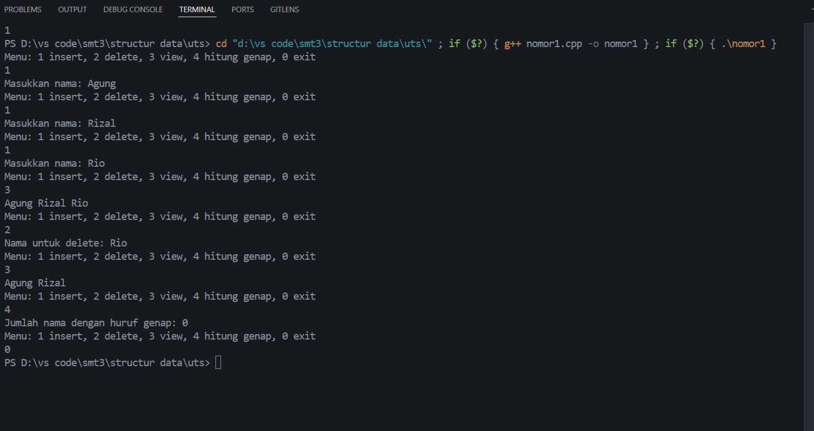

UJIAN TENGAH SEMESTER
PRAKTIKUM STRUKTUR DATA
CLO 3

Identitas 

Nama: Trisna Kusuma Ramadhany

NIM: 103112400277

Kelas: 12 IF 05

1. Kode Program

Berikut adalah kode program untuk  "program C++ untuk menambah atau insert dengan nama mahasiswa,delete,melihat daftar nama mahasiswa yng sudah di insert dan hitung serta menampilkan nama mahasiswa dengan huruf genap.".

```File: main.cpp
 * Author: Trisna Kusuma Ramadhany
 * NIM: 103112400277
 * Deskripsi: Program untuk menambahkan nama serta nenghitung angka genap dalam nama tersebut.
 * yang diinput oleh user adalah nama mahasiswa
 */

#include <iostream>
using namespace std;

struct Node {
    string nama;
    Node* next;
};

Node* head = nullptr;

void insertAkhir(string nama) {
    Node* n = new Node{nama, nullptr};
    if (!head) head = n;
    else {
        Node* t = head;
        while (t->next) t = t->next;
        t->next = n;
    }
}

void deleteNama(string target) {
    if (!head) return;
    Node* t = head, *p = nullptr;

    if (t->nama == target) { head = t->next; delete t; return; }

    while (t && t->nama != target) { p = t; t = t->next; }

    if (t) { p->next = t->next; delete t; }
}

void view() {
    Node* t = head;
    while (t) { cout << t->nama << " "; t = t->next; }
    cout << endl;
}

void hitungGenap() {
    int c = 0;
    for (Node* t = head; t; t = t->next)
        if (t->nama.length() % 2 == 0) c++;
    cout << "Jumlah nama dengan huruf genap: " << c << endl;
}

int main() {
    int pil; string nama;
    do {
        cout << "Menu: 1 insert, 2 delete, 3 view, 4 hitung genap, 0 exit\n";
        cin >> pil;
        if (pil == 1) { cout << "Masukkan nama: "; cin >> nama; insertAkhir(nama); }
        else if (pil == 2) { cout << "Nama untuk delete: "; cin >> nama; deleteNama(nama); }
        else if (pil == 3) view();
        else if (pil == 4) hitungGenap();
    } while (pil != 0);
}
```

2. Penjelasan Kode

Program tersebut  memakai Singly Linked List untuk menyimpan nama mahasiswa menggunakan node yang masing-masing berisi sebuah string dan pointer menuju node berikutnya. Daftar tersebut dikelola melalui pointer head, yang selalu menunjuk ke elemen pertama; ketika head bernilai nullptr, berarti list masih kosong. Proses penambahan nama dilakukan melalui fungsi insertAkhir, yang membuat node baru dan menempatkannya di bagian paling akhir list. Jika list masih kosong, node baru tersebut langsung menjadi head; jika tidak, program menelusuri list hingga menemukan node terakhir, kemudian menyambungkan node baru di sana. Penghapusan nama dilakukan oleh fungsi deleteNama. Jika nama yang dicari berada tepat di head, node tersebut dilepas dan head dipindahkan ke node berikutnya. Jika nama berada di tengah atau akhir, program menelusuri list sambil mencatat node sebelumnya untuk memutuskan sambungan dengan benar sebelum menghapus node target.

3. Output Program

Berikut adalah hasil eksekusi program (output) ketika dijalankan.
```

===== Program menampilkan menu =====
Masukkan sebuah nama 
input nama .

hasil output


```

4. Penjelasan Lanjutan (Analisis Output)
Program tersebut dengan menampilkan menu yang berisi beberapa pilihan  linked list dari memasukkan nama, menghapus nama, menampilkan isi list, hingga menghitung jumlah nama dengan panjang huruf genap. Ketika pengguna pertama kali memilih operasi insert, program meminta input sebuah nama dan memasukkannya sebagai node baru di bagian akhir list. Nama pertama yang dimasukkan adalah “Agung”, sehingga ia menjadi satu-satunya node di dalam list pada tahap awal. Saat pengguna mengulangi operasi yang sama dua kali berikutnya dan memasukkan “Rizal” lalu “Rio”, program kembali menambahkan masing-masing nama itu ke bagian paling akhir sehingga list kini berisi tiga elemen secara berurutan: Agung, Rizal, dan Rio.


5. Kesimpulan

Berdasarkan implementasi dan pengujian kode di atas, dapat disimpulkan bahwa:
Program ini merupakan implementasi sederhana dari Singly Linked List yang digunakan untuk menyimpan dan memanipulasi data berupa nama mahasiswa. Struktur data ini tersusun dari node–node yang saling terhubung melalui pointer, dimulai dari satu pointer utama yaitu head. Program menyediakan empat operasi utama: menambah nama di akhir list, menghapus nama pertama yang cocok, menampilkan seluruh isi list, dan menghitung jumlah nama dengan panjang huruf genap. Setiap operasi berjalan melalui proses traversal list, sehingga semua fungsi bekerja secara bertahap dari node pertama hingga node terakhir.
