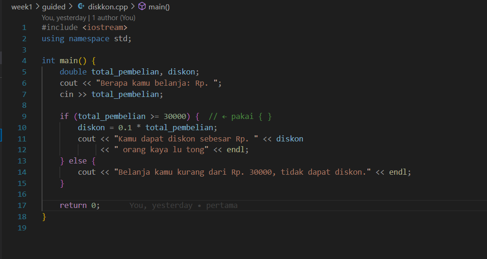
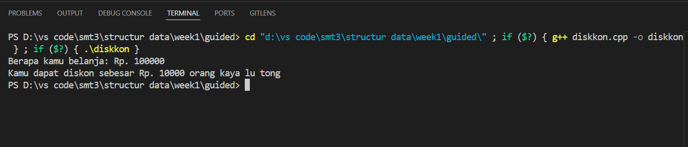

# Template Laporan Praktikum Struktur Data

## 1. Nama, NIM, Kelas
- **Nama**: Trisna Kusuma Ramadhany
- **NIM**: 103112400277
- **Kelas**: 12 IF 05

## 2. Motivasi Belajar Struktur Data
[saya termotovasi di struktur data karena melatih berpikir logis Selain itu, penguasaan struktur data juga menjadi bekal berharga untuk menghadapi tantangan dunia kerja, karena hampir semua perusahaan IT menguji kemampuan ini dalam seleksi.]

## 3. Dasar Teori
Struktur data adalah cara mengorganisasikan, menyimpan, dan mengelola data agar dapat digunakan secara efisien dalam pemrograman. Dengan struktur data, data tidak hanya disimpan secara acak, tetapi diatur dalam bentuk tertentu seperti array, linked list, stack, queue, tree, atau graph, sehingga lebih mudah diakses, dimodifikasi, dan diolah sesuai kebutuhan. Pemilihan struktur data yang tepat sangat penting karena berpengaruh langsung terhadap kecepatan eksekusi program, penggunaan memori, serta efektivitas dalam menyelesaikan suatu permasalahan komputasi.. Berikut adalah teori dasar mengenai **Graf** dan **Pohon**:

- **Graf**: adalah sekumpulan simpul (vertex) yang saling terhubung melalui sisi (edge). Graf digunakan untuk merepresentasikan hubungan antar objek, misalnya jaringan komputer, peta jalan, atau hubungan pertemanan di media sosial. Graf bisa berbentuk berarah (directed graph) atau tidak berarah (undirected graph), dan dapat memiliki bobot pada sisinya (weighted graph)..
- **Pohon**: adalah struktur data hierarki yang terdiri dari simpul (node) dengan satu simpul khusus sebagai akar (root) dan cabang-cabang yang terhubung tanpa membentuk siklus. Pohon merupakan kasus khusus dari graf yang terhubung dan tidak memiliki siklus. Contohnya adalah struktur folder pada komputer, silsilah keluarga, atau binary tree dalam algoritma pencarian.

## 4. Guided
### 4.1 Guided 1

[Penjelasan tentang guided pertama, termasuk kode yang telah diberikan dan cara kerjanya.]

output:

### 4.2 Guided 2
[Penjelasan tentang guided kedua, meliputi kode dan penjelasan fungsinya.]

### 4.3 Guided 3
[Penjelasan tentang guided ketiga yang sesuai dengan praktikum yang telah dilakukan.]

## 5. Unguided
### 5.1 Unguided 1
[Penjelasan tentang unguided pertama, termasuk kode yang telah diimplementasikan oleh Anda.]

### 5.2 Unguided 2
[Penjelasan tentang unguided kedua, termasuk kode dan cara implementasinya.]

### 5.3 Unguided 3
[Penjelasan tentang unguided ketiga, termasuk aplikasi atau pengembangan lebih lanjut yang Anda lakukan.]

## 6. Kesimpulan
[Isi dengan kesimpulan dari seluruh praktikum ini, apakah tujuan praktikum tercapai, dan bagaimana Anda mengimplementasikan dan memahami teori yang dipelajari.]

## 7. Referensi
1. [Buku atau artikel yang Anda gunakan untuk referensi, jika ada]
2. [Sumber lain yang relevan dengan topik praktikum ini]