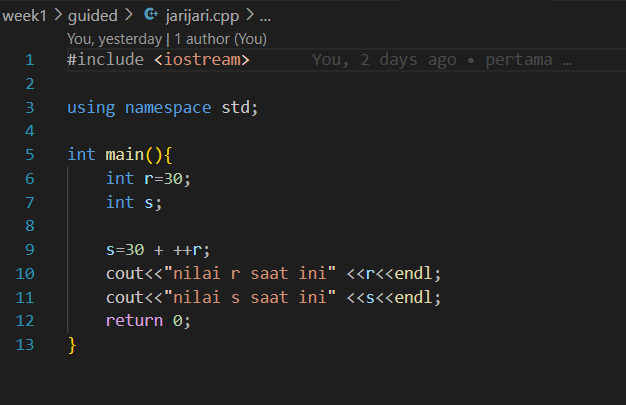
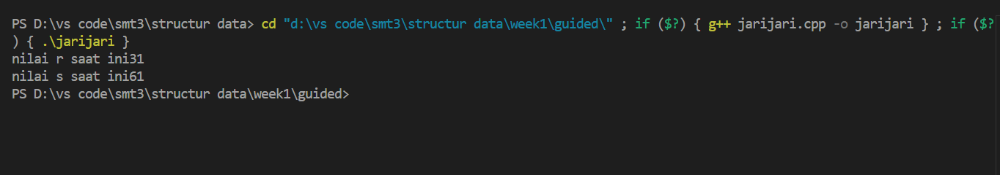
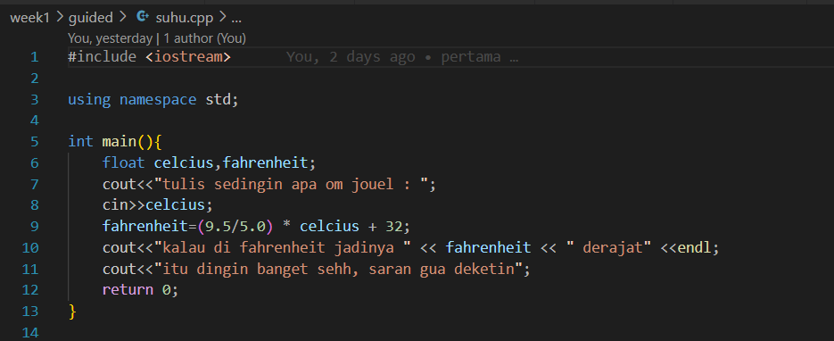
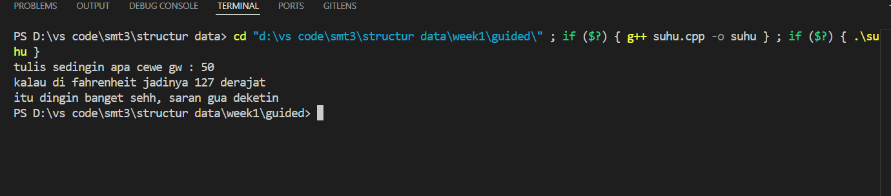
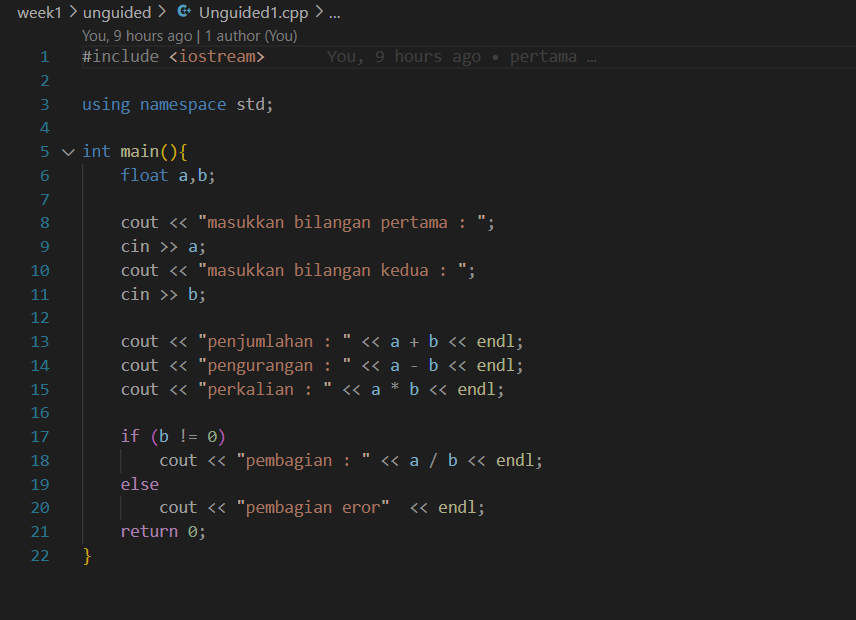
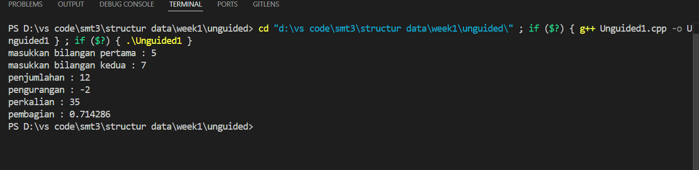
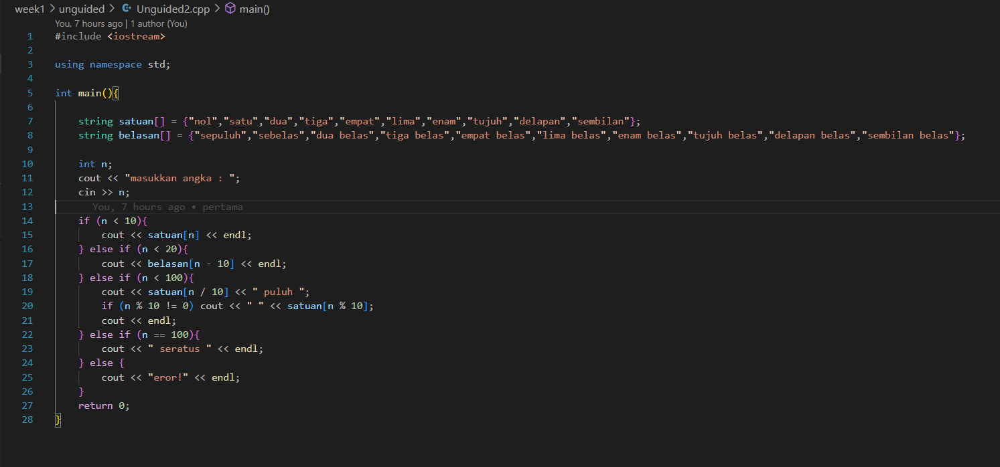
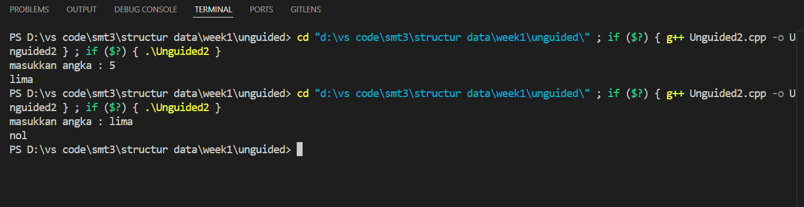
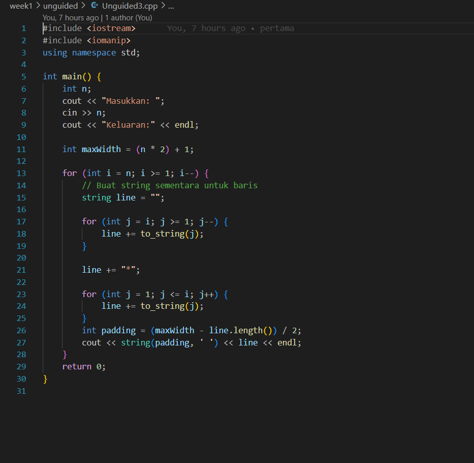
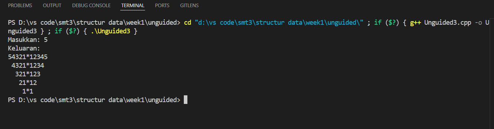

# Template Laporan Praktikum Struktur Data

## 1. Nama, NIM, Kelas
- **Nama**: Trisna Kusuma Ramadhany
- **NIM**: 103112400277
- **Kelas**: 12 IF 05

## 2. Motivasi Belajar Struktur Data
[saya termotovasi di struktur data karena melatih berpikir logis Selain itu, penguasaan struktur data juga menjadi bekal berharga untuk menghadapi tantangan dunia kerja, karena hampir semua perusahaan IT menguji kemampuan ini dalam seleksi.]

## 3. Dasar Teori
Struktur data adalah cara mengorganisasikan, menyimpan, dan mengelola data agar dapat digunakan secara efisien dalam pemrograman. Dengan struktur data, data tidak hanya disimpan secara acak, tetapi diatur dalam bentuk tertentu seperti array, linked list, stack, queue, tree, atau graph, sehingga lebih mudah diakses, dimodifikasi, dan diolah sesuai kebutuhan. Pemilihan struktur data yang tepat sangat penting karena berpengaruh langsung terhadap kecepatan eksekusi program, penggunaan memori, serta efektivitas dalam menyelesaikan suatu permasalahan komputasi.. Berikut adalah teori dasar mengenai **Graf** dan **Pohon**:

- **Graf**: adalah sekumpulan simpul (vertex) yang saling terhubung melalui sisi (edge). Graf digunakan untuk merepresentasikan hubungan antar objek, misalnya jaringan komputer, peta jalan, atau hubungan pertemanan di media sosial. Graf bisa berbentuk berarah (directed graph) atau tidak berarah (undirected graph), dan dapat memiliki bobot pada sisinya (weighted graph)..
- **Pohon**: adalah struktur data hierarki yang terdiri dari simpul (node) dengan satu simpul khusus sebagai akar (root) dan cabang-cabang yang terhubung tanpa membentuk siklus. Pohon merupakan kasus khusus dari graf yang terhubung dan tidak memiliki siklus. Contohnya adalah struktur folder pada komputer, silsilah keluarga, atau binary tree dalam algoritma pencarian.

## 4. Guided
### 4.1 Guided 1

Penjelasan : Program ini bertujuan untuk menghitung diskon belanja jika total belanja lebih dari RP. 30.000 . Jika memenuhi syarat, maka pembeli akan mengadaptkan diskon 10%. Jika tidak, maka akan muncul pesan kalau pesanan masih kurang.

output:

### 4.2 Guided 2

Penjelasan : Program ini digunakan untuk mengubah suhu dari satuan Celcius ke Fahrenheit, lalu memberikan komentar lucu berdasarkan hasilnya.

output :

### 4.3 Guided 3

Penjelasan : Program ini digunakan untuk mendemonstrasikan penggunaan operator tanda plus (+) pada ekspresi aritmatika. Pada program tersebut, variabel r diberi nilai awal 20, kemudian nilai variabel s dihitung menggunakan ekspresi 20 + + + r. Ekspresi tersebut sebenarnya dibaca sebagai 20 + (+(+r)), sehingga nilai r tetap 20. Hasil dari penjumlahan 20 dengan 20 disimpan ke dalam variabel s, yaitu 40. Setelah itu, program menampilkan nilai aktual dari variabel r dan s ke layar untuk menunjukkan bahwa variabel r tidak berubah, sedangkan s berisi hasil perhitungan.

output :

## 5. Unguided
### 5.1 Unguided 1

Penjelasan : Program di atas adalah contoh program sederhana untuk melakukan operasi hitung dasar dengan dua bilangan bertipe float. Pertama, program mendefinisikan dua variabel, yaitu a dan b. Setelah itu, program meminta pengguna untuk memasukkan dua bilangan melalui cin.Setelah pengguna memberikan input, program langsung menghitung dan menampilkan hasil dari:

Penjumlahan (a + b)
Pengurangan (a - b)
Perkalian (a * b)
Khusus untuk operasi pembagian, program menggunakan struktur if-else agar tidak terjadi kesalahan ketika membagi dengan nol. Jika nilai b tidak sama dengan nol, maka hasil pembagian a / b akan ditampilkan. Tetapi jika nilai b adalah nol, program akan menampilkan pesan bahwa pembagian tidak bisa dilakukan.

output :

### 5.2 Unguided 2

Penjelasan :  Program ini berfungsi untuk mengubah angka yang dimasukkan pengguna menjadi bentuk tulisan dalam bahasa Indonesia dengan rentang 0 sampai 100. Pertama, program mendefinisikan dua buah array string, yaitu satuan yang menyimpan kata untuk angka 0 sampai 9, dan belasan yang menyimpan kata untuk angka 10 sampai 19. Setelah itu, program meminta pengguna memasukkan sebuah angka, lalu angka tersebut diproses menggunakan struktur percabangan if-else. Jika angka kurang dari 10, program langsung menampilkan kata dari array satuan. Jika angka berada di antara 10 sampai 19, program menampilkan kata dari array belasan dengan indeks yang disesuaikan. Untuk angka 20 sampai 99, program akan membagi angka dengan 10 untuk mendapatkan nilai puluhan, lalu menampilkannya dengan tambahan kata "puluh". Jika angka tersebut tidak bulat puluhan, maka sisa bagi 10 akan digunakan untuk menampilkan satuannya. Jika angka yang dimasukkan adalah 100, maka program langsung menampilkan "seratus". Sedangkan jika angka yang dimasukkan berada di luar rentang 0 sampai 100, program akan menampilkan pesan "eror!".

output :

### 5.3 Unguided 3

Penjelasan : Program ini berfungsi untuk mencetak pola angka dengan menggunakan perulangan bersarang (nested loop). Pertama, program meminta pengguna memasukkan sebuah bilangan bulat n sebagai batas pola. Pada perulangan pertama, nilai i dimulai dari n dan terus berkurang hingga 1. Di dalamnya terdapat perulangan lain dengan variabel j yang menampilkan deret angka menurun dari i hingga 1. Setelah angka-angka tersebut ditampilkan, program menambahkan sebuah tanda bintang * di akhir baris. Selanjutnya, terdapat perulangan kedua yang menampilkan deret angka naik dari 1 hingga i, kemudian diakhiri dengan pindah baris. Dengan kombinasi kedua perulangan ini, program menghasilkan pola simetris berupa angka menurun di sebelah kiri, tanda bintang di tengah, dan angka menaik di sebelah kanan. Sebagai contoh, jika pengguna memasukkan angka 3, keluaran yang ditampilkan adalah 321123 pada baris pertama, 2112 pada baris kedua, dan 1*1 pada baris terakhir.

output :

## 6. Kesimpulan
 Dari praktikum yang saya lakukan  dapat disimpulkan bahwa tujuan untuk memahami dasar-dasar pemrograman telah tercapai, mulai dari penggunaan percabangan, operasi aritmatika, konversi data, hingga perulangan bersarang. Latihan Guided membantu memahami konsep dasar, sedangkan latihan Unguided melatih logika dalam menyelesaikan masalah secara mandiri dan bisa memahaminya.
## 7. Referensi
1. GeeksforGeeks. “C++ Programming Language.” https://www.geeksforgeeks.org/c-plus-plus/
2. W3Schools. “C++ Tutorial.” https://www.w3schools.com/cpp/