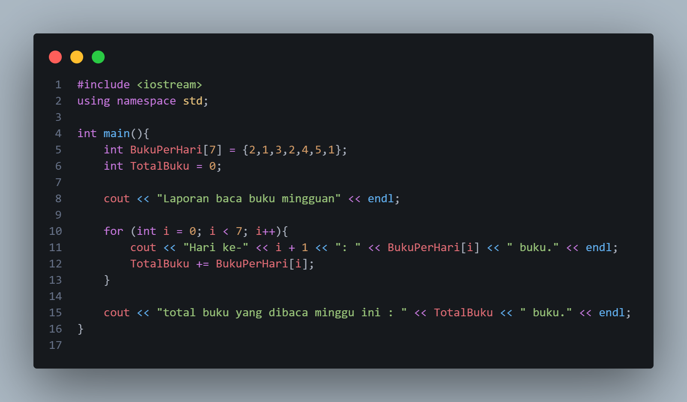
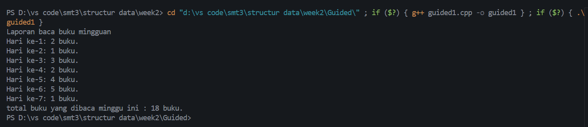
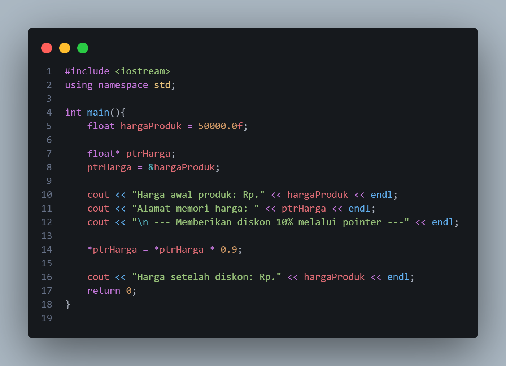
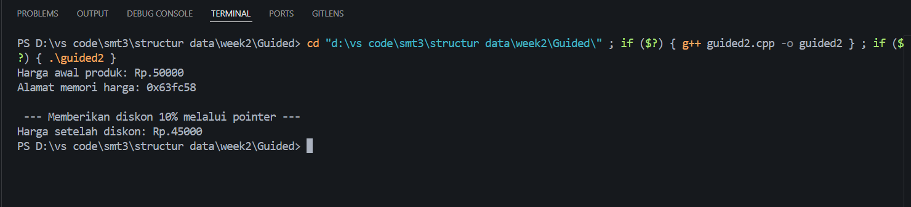
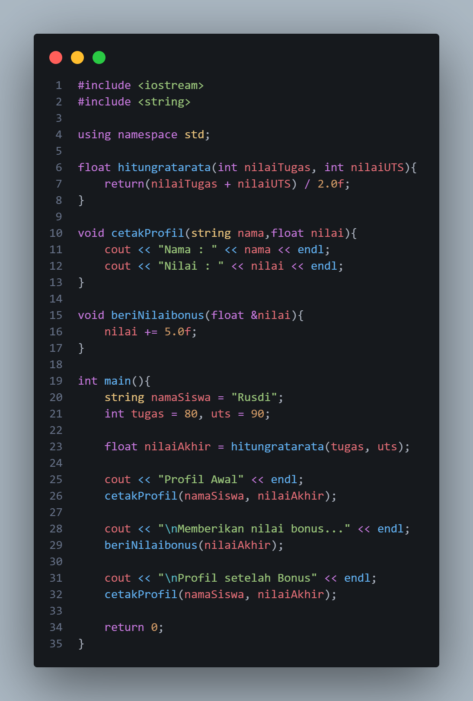
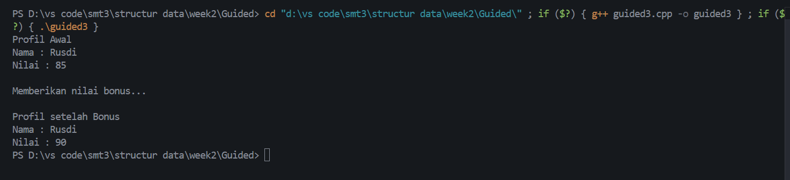
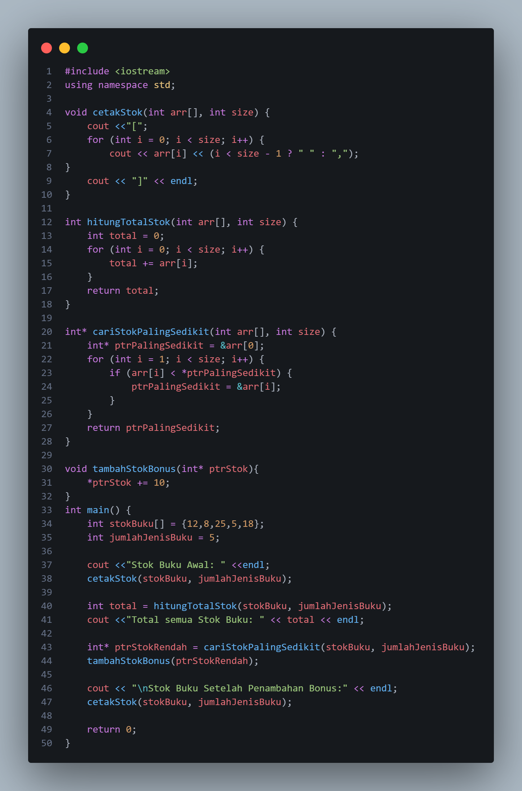
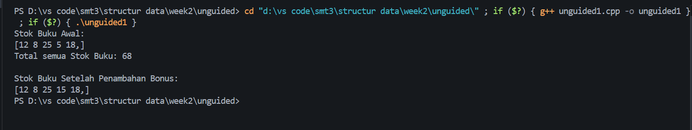

# Template Laporan Praktikum Struktur Data

## 1. Nama, NIM, Kelas
- **Nama**: Trisna Kusuma Ramadhany
- **NIM**: 103112400277
- **Kelas**: 12 IF 05

## 2. Motivasi Belajar Struktur Data
[saya termotovasi di struktur data karena melatih berpikir logis Selain itu, penguasaan struktur data juga menjadi bekal berharga untuk menghadapi tantangan dunia kerja, karena hampir semua perusahaan IT menguji kemampuan ini dalam seleksi.]

## 3. Dasar Teori
Struktur data adalah cara mengorganisasikan, menyimpan, dan mengelola data agar dapat digunakan secara efisien dalam pemrograman. Dengan struktur data, data tidak hanya disimpan secara acak, tetapi diatur dalam bentuk tertentu seperti array, linked list, stack, queue, tree, atau graph, sehingga lebih mudah diakses, dimodifikasi, dan diolah sesuai kebutuhan. Pemilihan struktur data yang tepat sangat penting karena berpengaruh langsung terhadap kecepatan eksekusi program, penggunaan memori, serta efektivitas dalam menyelesaikan suatu permasalahan komputasi.. Berikut adalah teori dasar mengenai **Graf** dan **Pohon**:

- **Konsep Array**: Merupakan salah satu struktur data dasar yang digunakan untuk menyimpan sekumpulan data yang memiliki tipe sama di dalam satu variabel. Setiap elemen dalam array disimpan secara berurutan di memori komputer dan dapat diakses menggunakan indeks, yaitu nomor urut yang dimulai dari nol. Dengan adanya array, penyimpanan data yang jumlahnya banyak menjadi lebih efisien karena tidak perlu mendeklarasikan banyak variabel. Misalnya, untuk mencatat jumlah buku yang dibaca selama tujuh hari, cukup digunakan satu array dengan tujuh elemen yang mewakili masing-masing hari. Array dapat berbentuk satu dimensi seperti daftar nilai, dua dimensi seperti tabel, atau bahkan multidimensi untuk data yang lebih kompleks.
- **Konsep Pointer**: variabel khusus dalam pemrograman yang digunakan untuk menyimpan alamat memori dari variabel lain, bukan nilai langsung dari variabel tersebut. Dengan pointer, program dapat mengakses dan memanipulasi data secara tidak langsung melalui alamat memori yang ditunjuknya. Konsep ini sangat penting karena memungkinkan efisiensi dalam pengelolaan memori serta memberikan fleksibilitas tinggi dalam pemrosesan data. Dalam penggunaannya, pointer dapat menunjuk ke berbagai tipe data, seperti integer, float, atau bahkan ke struktur data yang lebih kompleks.
- **Konsep Fungsi dan prosedur**: merupakan konsep dasar dalam pemrograman yang digunakan untuk membagi program menjadi bagian-bagian kecil yang terstruktur dan mudah dikelola. Fungsi adalah blok kode yang memiliki tugas tertentu dan dapat mengembalikan suatu nilai setelah proses dijalankan. Biasanya fungsi menerima data melalui parameter, melakukan perhitungan atau operasi, lalu mengembalikan hasilnya ke bagian program yang memanggilnya.prosedur mirip dengan fungsi, namun tidak mengembalikan nilai; prosedur hanya menjalankan serangkaian instruksi tertentu untuk tujuan tertentu, seperti menampilkan data atau mengubah isi variabel.

## 4. Guided
### 4.1 Guided 1
)

Penjelasan : array BukuPerHari berisi tujuh elemen yang merepresentasikan jumlah buku yang dibaca setiap hari, mulai dari hari pertama hingga hari ketujuh. Variabel TotalBuku diinisialisasi dengan nilai nol untuk menampung total buku yang dibaca sepanjang minggu. Program menampilkan judul “Laporan baca buku mingguan”, lalu menggunakan perulangan for untuk menelusuri setiap elemen array. Di dalam perulangan, program menampilkan jumlah buku yang dibaca pada masing-masing hari dan menambahkan nilai tersebut ke variabel TotalBuku. Setelah perulangan selesai, program menampilkan total keseluruhan buku yang dibaca selama satu minggu. Dengan demikian, program ini membantu menampilkan data harian serta menghitung total bacaan mingguan secara otomatis.

output:

### 4.2 Guided 2

Penjelasan : variabel hargaProduk bertipe float diinisialisasi dengan nilai 50.000 yang merepresentasikan harga suatu produk. Kemudian, dibuat sebuah pointer bernama ptrHarga yang bertipe float*, dan pointer ini diisi dengan alamat memori dari hargaProduk menggunakan operator &. Dengan demikian, ptrHarga menunjuk langsung ke lokasi memori tempat nilai hargaProduk disimpan. Program kemudian menampilkan harga awal produk dan alamat memorinya. Setelah itu, dilakukan operasi pemberian diskon sebesar 10% melalui pointer, yaitu dengan mengalikan nilai yang ditunjuk oleh pointer (*ptrHarga) dengan 0.9. Karena pointer menunjuk ke variabel yang sama, perubahan ini juga mengubah nilai hargaProduk secara langsung. Terakhir, program menampilkan harga produk setelah diskon. Program ini memperlihatkan bagaimana pointer dapat digunakan untuk memanipulasi data secara tidak langsung melalui alamat memori dari suatu variabel.

output :

### 4.3 Guided 3

Penjelasan : Program ini menghitung rata-rata nilai tugas dan UTS seorang siswa, lalu menampilkan profilnya sebelum dan sesudah mendapatkan bonus nilai. Fungsi hitungratarata() menghitung rata-rata dua nilai, cetakProfil() menampilkan nama dan nilai siswa, sedangkan beriNilaibonus() menambah nilai sebesar 5 melalui parameter referensi agar perubahan langsung berlaku pada variabel aslinya.

output :

## 5. Unguided
### 5.1 Unguided 1

Penjelasan : untuk menghitung rata-rata nilai seorang siswa dari nilai tugas dan nilai UTS, kemudian menampilkan profil siswa sebelum dan sesudah mendapatkan tambahan nilai bonus. Pada awal program, dibuat beberapa fungsi untuk mempermudah proses. Fungsi pertama menghitung nilai rata-rata dari dua nilai yang diberikan, yaitu nilai tugas dan nilai UTS, lalu mengembalikan hasilnya sebagai nilai akhir. Fungsi kedua digunakan untuk menampilkan profil siswa dengan menuliskan nama serta nilai yang dimilikinya ke layar. Fungsi ketiga berfungsi menambahkan nilai bonus sebesar lima poin pada nilai yang sudah ada, dan karena menggunakan parameter referensi, perubahan nilainya akan langsung memengaruhi nilai aslinya.

output :

## 6. Kesimpulan
 Dari praktikum yang saya lakukan  dapat disimpulkan bahwa tujuan bahwa praktikum berhasil membantu memahami dasar-dasar pemrograman dan penerapan struktur data sederhana. Melalui latihan Guided dan unguided.juga memberikan pemahaman tentang penggunaan logika percabangan, operasi aritmatika, manipulasi data, dan perulangan bersarang yang menjadi fondasi penting dalam mempelajari struktur data
## 7. Referensi
1. GeeksforGeeks. “C++ Programming Language.” https://www.geeksforgeeks.org/c-plus-plus/
2. W3Schools. “C++ Tutorial.” https://www.w3schools.com/cpp/