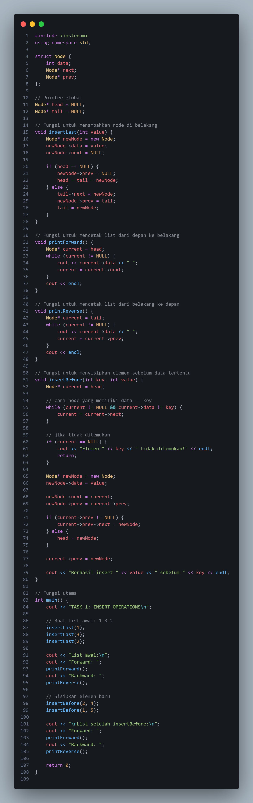

# Template Laporan Praktikum Struktur Data

## 1. Nama, NIM, Kelas
- **Nama**: Trisna Kusuma Ramadhany
- **NIM**: 103112400277
- **Kelas**: 12 IF 05

## 2. Motivasi Belajar Struktur Data
[saya termotovasi di struktur data karena melatih berpikir logis Selain itu, penguasaan struktur data juga menjadi bekal berharga untuk menghadapi tantangan dunia kerja, karena hampir semua perusahaan IT menguji kemampuan ini dalam seleksi.]

## 3. Dasar Teori
Struktur data adalah cara untuk menyimpan dan mengorganisir data dalam komputer agar dapat digunakan secara efisien. Dalam konteks mata kuliah Struktur Data dan Algoritma Dasar, konsep seperti percabangan, perulangan, dan operasi aritmatika merupakan pondasi utama yang digunakan dalam membangun logika program. Struktur ini membantu komputer dalam memutuskan, menghitung, dan menampilkan hasil sesuai kebutuhan pengguna.

- **Konsep Double Linked List**: Double Linked List merupakan bentuk lanjutan dari Single Linked List, di mana setiap elemen (node) memiliki dua buah pointer: satu menunjuk ke node sebelumnya (prev) dan satu lagi menunjuk ke node berikutnya (next). Dengan adanya dua arah penunjuk ini, proses penelusuran data dapat dilakukan baik secara maju (forward traversal) maupun mundur (backward traversal).
- **Konsep Pointer**: Pointer adalah variabel khusus yang menyimpan alamat memori dari variabel lain. Dalam DLL, pointer digunakan untuk menghubungkan antar-node. Misalnya, P->next menunjuk ke node berikutnya, sedangkan P->prev menunjuk ke node sebelumnya. Penggunaan pointer sangat penting karena kesalahan dalam pengaturan hubungan antar-node (misalnya salah mengatur next atau prev) dapat menyebabkan kehilangan data (data loss) atau kerusakan memori (memory leak).
- **Konsep Modularitas**: Dalam implementasinya, fungsi-fungsi seperti insertFirst(), insertLast(), deleteNode(), dan displayList() digunakan agar program lebih terstruktur, mudah dibaca, dan mudah diuji. Setiap fungsi memiliki tanggung jawab yang jelas, sehingga kode menjadi modular dan dapat digunakan kembali (reusable). Prinsip ini sejalan dengan konsep abstraction dalam pemrograman terstruktur.

## 4. Guided
### 4.1 Guided 1

Penjelasan : Program ini membuat struktur elmlist yang berisi data (info), pointer ke elemen berikutnya (next), dan pointer ke elemen sebelumnya (prev). Lalu terdapat List yang menyimpan elemen pertama (first) dan elemen terakhir (last). Fungsi insertFirst digunakan untuk menambahkan data di awal list, insertLast menambahkan data di akhir list, dan insertAfter menambahkan data setelah elemen tertentu. Fungsi alokasi membuat node baru dengan data yang diinputkan, sedangkan printInfo digunakan untuk menampilkan isi dari list.

output:

### 4.2 Guided 2

Penjelasan : Program ini membuat struktur elmlist yang berisi data (info), pointer ke elemen berikutnya (next), dan pointer ke elemen sebelumnya (prev). Struktur List digunakan untuk menyimpan alamat elemen pertama (first) dan terakhir (last). Fungsi alokasi berfungsi membuat node baru dengan nilai tertentu, sedangkan dealokasi digunakan untuk menghapus node dari memori. Fungsi insertFirst menambahkan data di bagian depan list, sedangkan printInfo menampilkan seluruh isi list dari elemen pertama hingga terakhir. Fungsi deleteFirst digunakan untuk menghapus elemen pertama pada list, deleteLast untuk menghapus elemen terakhir, dan deleteAfter untuk menghapus elemen yang berada setelah elemen tertentu. Pada fungsi main, list diinisialisasi dalam keadaan kosong, kemudian dilakukan proses penambahan dan penghapusan elemen menggunakan fungsi-fungsi tersebut, serta menampilkan hasilnya sebelum dan sesudah proses penghapusan.

output :

## 5. Unguided
### 5.1 Unguided 1

Penjelasan :Program ini merupakan Struktur Node tiga komponen, yaitu data (data), pointer ke elemen berikutnya (next), dan pointer ke elemen sebelumnya (prev). Program menggunakan dua pointer global, yaitu head untuk menunjuk elemen pertama dan tail untuk menunjuk elemen terakhir dalam list. Fungsi insertLast digunakan untuk menambahkan elemen baru di bagian akhir list, dengan memperbarui hubungan antar node agar tetap saling terhubung dua arah. Fungsi printForward menampilkan isi list dari depan ke belakang, sedangkan printReverse mencetak list dari belakang ke depan dengan memanfaatkan pointer prev. 

output :

### 5.2 Unguided 2

Penjelasan : Program ini merupakan implementasi Double Linked List (DLL) yang berfokus pada operasi penghapusan data. Struktur Node terdiri dari tiga bagian yaitu data, next, dan prev untuk menghubungkan antar node secara dua arah. Pointer global head dan tail digunakan untuk menandai elemen pertama dan terakhir dari list. Fungsi insertFirst() menambahkan node baru di awal list, sedangkan printForward() digunakan untuk menampilkan seluruh isi list dari depan ke belakang. Fungsi deleteByValue() menghapus node berdasarkan nilai tertentu dengan menyesuaikan posisi pointer sesuai letak node (awal, tengah, atau akhir), dan deleteAll() menghapus semua node dalam list hingga kosong. Pada fungsi utama, program menambahkan beberapa data, menampilkan isi list, menghapus data tertentu, menampilkan hasilnya, kemudian menambah data baru kembali sebelum akhirnya menghapus seluruh isi list. Program ini menunjukkan proses dasar pengelolaan data pada struktur Double Linked List secara efisien.

output :

### 5.3 Unguided 3

Penjelasan : Program ini membahas konsep Double Linked List lanjutan yang berfungsi untuk mengelola data secara dinamis dua arah, yaitu dari depan ke belakang maupun sebaliknya. Konsep ini memungkinkan setiap elemen saling terhubung dua arah sehingga proses penambahan dan penghapusan data dapat dilakukan dengan mudah di berbagai posisi. Program ini menggambarkan bagaimana struktur data tersebut digunakan untuk menyisipkan data baru baik di awal, akhir, maupun di tengah list sesuai dengan urutan yang diinginkan. Selain itu, program juga menunjukkan cara melakukan penghapusan data tertentu dan penghapusan seluruh elemen list secara efisien.

output :

## 6. Kesimpulan
 Dari praktikum yang saya lakukan  dapat disimpulkan bahwa Dari Double Linked List (DLL), dapat disimpulkan bahwa struktur data ini memiliki keunggulan dalam mengelola data secara dinamis dengan kemampuan traversing dua arah, yaitu dari depan ke belakang maupun sebaliknya. Double Linked List memungkinkan proses penambahan (insert) dan penghapusan (delete) elemen di berbagai posisi—baik di awal, tengah, maupun akhir—dengan efisien tanpa perlu menggeser elemen lain seperti pada array.
## 7. Referensi
1. GeeksforGeeks. “C++ Programming Language.” https://www.geeksforgeeks.org/c-plus-plus/
2. W3Schools. “C++ Tutorial.” https://www.w3schools.com/cpp/