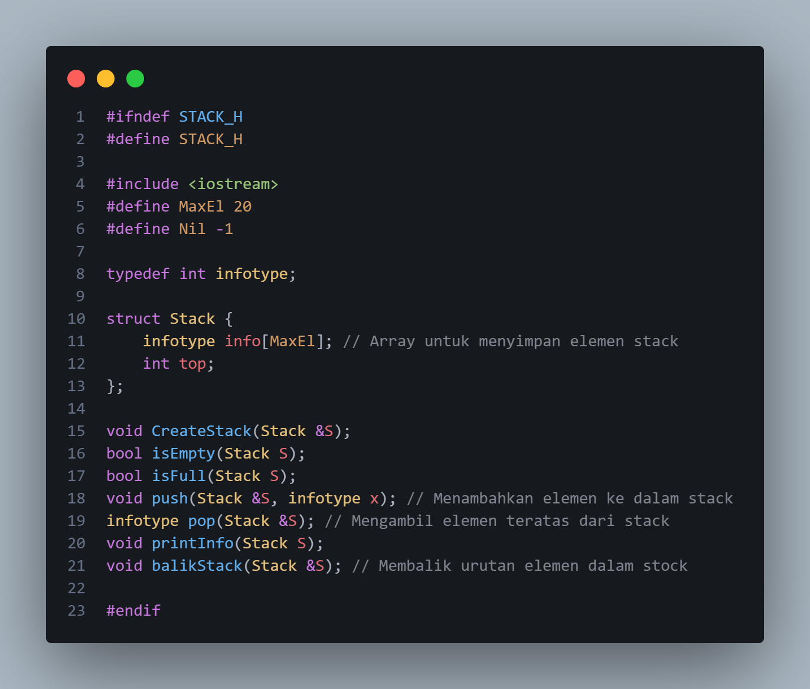
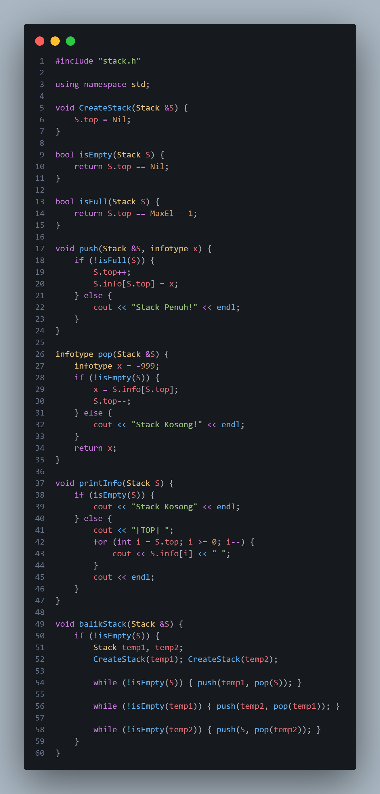
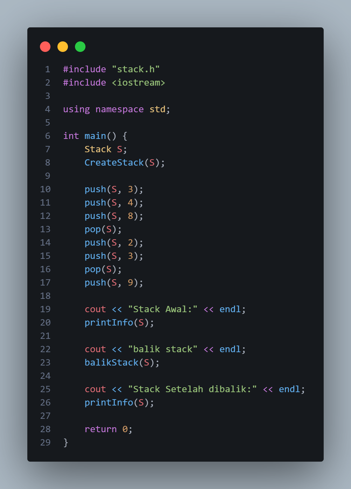
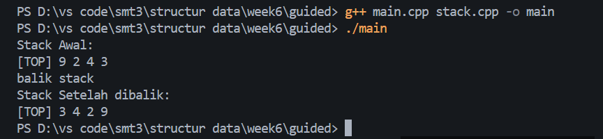
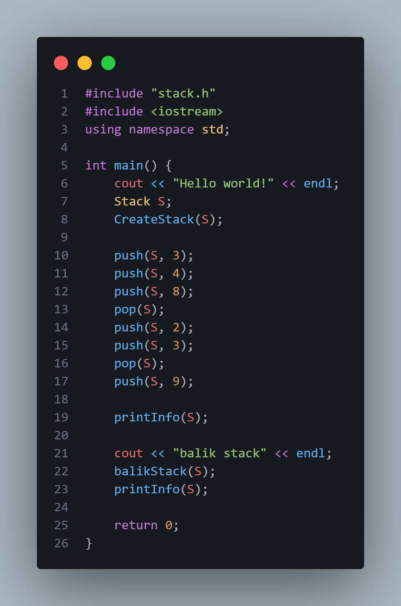
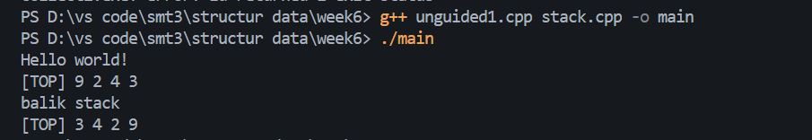
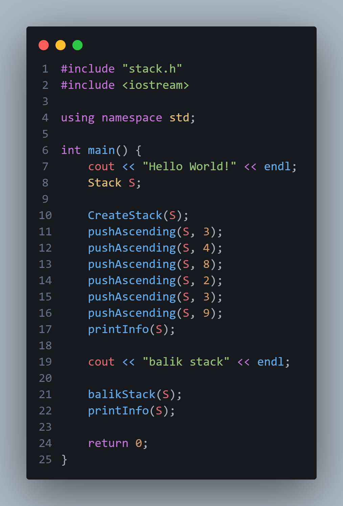
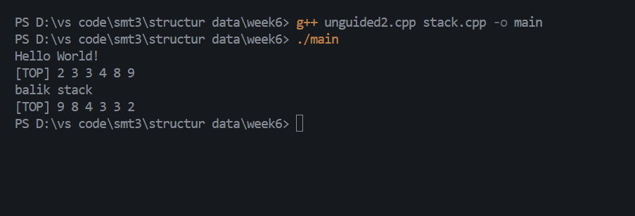
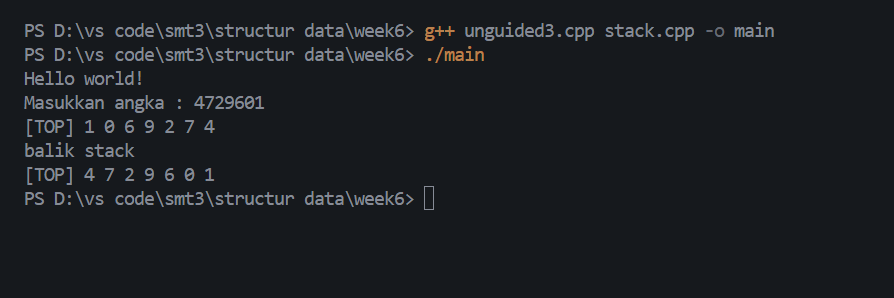

# Laporan Praktikum Struktur Data

## 1. Nama, NIM, Kelas
- **Nama**: Trisna Kusuma Ramadhany
- **NIM**: 103112400277
- **Kelas**: 12 IF 05

## 2. Motivasi Belajar Struktur Data
[saya termotovasi di struktur data karena melatih berpikir logis Selain itu, penguasaan struktur data juga menjadi bekal berharga untuk menghadapi tantangan dunia kerja, karena hampir semua perusahaan IT menguji kemampuan ini dalam seleksi.]

## 3. Dasar Teori
Struktur data adalah cara mengorganisasikan, menyimpan, dan mengelola data agar dapat digunakan secara efisien dalam pemrograman.  

Materi yang dibahas dalam kode-kode ini adalah tentang Stack (Tumpukan), yang merupakan salah satu bentuk Abstract Data Type (ADT) linear. Konsep fundamental dari stack adalah prinsip LIFO (Last-In, First-Out). Gampangnya, LIFO ini bisa diibaratkan kayak tumpukan piring; piring yang terakhir ditaruh di tumpukan paling atas (Last-In) adalah piring yang akan pertama kali diambil (First-Out). Elemen data hanya bisa ditambah (dimasukkan) dan diambil (dihapus) dari satu ujung yang sama, yang biasa disebut sebagai TOP (puncak) dari stack.

Implementasi stack yang digunakan dalam materi kali ini adalah Static Array Implementation (atau alokasi kontigu/sekuensial). Dalam implementasi ini, sebuah array dengan ukuran yang tetap (didefinisikan sebagai MaxEl di stack.h) dialokasikan di memori untuk menyimpan elemen-elemen stack. Sebuah variabel integer, yaitu TOP, digunakan sebagai marker atau penanda untuk melacak indeks dari elemen teratas. Ketika stack kosong, TOP diatur ke nilai Nil (yaitu -1). Sebaliknya, stack dianggap penuh (IsFull) ketika TOP telah mencapai indeks maksimum array (MaxEl - 1).

## 4. Guided
### 4.1 Guided 1

Penjelasan :  stack.h itu header file yang berisi rancangan struktur data stack (tumpukan) dengan prinsip LIFO (Last In, First Out). Di dalamnya terdapat deklarasi struktur Stack yang menyimpan data dalam array berukuran maksimal 20 elemen (MaxEl = 20) dan variabel top sebagai penanda posisi elemen teratas. Nilai top akan bernilai -1 (Nil) jika stack kosong. stack.h ini juga berisi deklarasi fungsi-fungsi penting seperti CreateStack untuk membuat stack kosong, isEmpty dan isFull untuk mengecek kondisi stack, push untuk menambah data, pop untuk mengambil data teratas, printInfo untuk menampilkan isi stack, serta balikStack untuk membalik urutan isi stack. Secara singkat, stack.h berfungsi sebagai rancangan dasar yang mendefinisikan bentuk dan operasi dasar pada stack, sedangkan implementasi logikanya biasanya ditulis di file lain, yaitu stack.cpp.

### 4.2 Guided 2

Penjelasan : stack.cpp ini berisi implementasi fungsi-fungsi yang sudah dideklarasikan di file stack.h. Fungsi CreateStack digunakan untuk membuat stack kosong dengan mengatur nilai top menjadi -1. Fungsi isEmpty dan isFull digunakan untuk memeriksa apakah stack kosong atau penuh. Fungsi push berfungsi menambahkan elemen baru ke bagian atas stack jika belum penuh, sedangkan pop digunakan untuk menghapus dan mengambil elemen teratas dari stack jika tidak kosong. Fungsi printInfo menampilkan isi stack dari elemen paling atas hingga paling bawah, dan akan menampilkan pesan jika stack kosong. Terakhir, fungsi balikStack digunakan untuk membalik urutan isi stack dengan cara memanfaatkan dua stack sementara. Secara keseluruhan, file ini berisi logika utama untuk mengoperasikan stack, mulai dari menambah, menghapus, menampilkan, hingga membalik data

### 4.3 Guided 3

Penjelasan : Program ini fungsi main() yang digunakan untuk menguji operasi stack. Pertama, program membuat sebuah stack kosong dengan CreateStack(S). Kemudian beberapa operasi dilakukan: menambahkan elemen dengan push (3, 4, 8), menghapus elemen teratas dengan pop, lalu menambah elemen lagi (2, 3), menghapus lagi satu elemen, dan terakhir menambahkan angka 9. Setelah semua operasi selesai, program menampilkan isi stack menggunakan printInfo dengan judul "Stack Awal". Selanjutnya, fungsi balikStack dipanggil untuk membalik urutan isi stack, lalu hasilnya kembali ditampilkan dengan tulisan "Stack Setelah dibalik". Secara sederhana, program ini menunjukkan cara kerja dasar stack mulai dari penambahan, penghapusan, hingga pembalikan isi stack.

output :

## 5. Unguided
### 5.1 Unguided 1

Penjelasan : Program ini merupakan implementasi dasar dari operasi stack (tumpukan) dalam bahasa C++. Pertama, program menampilkan teks “Hello world!” lalu membuat sebuah stack kosong dengan memanggil fungsi CreateStack(S). Setelah itu, program melakukan beberapa operasi push untuk menambahkan elemen ke dalam stack, seperti angka 3, 4, dan 8. Kemudian dilakukan pop untuk menghapus elemen teratas, lalu ditambahkan lagi elemen 2, 3, dan 9 dengan kombinasi push dan pop sesuai urutan yang ada. Setelah semua operasi dilakukan, program menampilkan isi stack menggunakan fungsi printInfo(S). Selanjutnya, program menampilkan teks “balik stack” dan memanggil fungsi balikStack(S) untuk membalik urutan elemen dalam stack, kemudian menampilkan hasil akhirnya kembali. Program ini bertujuan untuk menunjukkan cara kerja operasi dasar pada struktur data stack, seperti push, pop, dan pembalikan urutan elemen.

output :

### 5.2 Unguided 2

Penjelasan :Program ini contoh penggunaan stack dengan fitur pushAscending, yaitu menambahkan elemen ke dalam stack secara berurutan dari nilai terkecil ke terbesar. Pertama, program menampilkan teks “Hello World!” lalu membuat stack kosong dengan CreateStack(S). Setelah itu, beberapa nilai seperti 3, 4, 8, 2, 3, dan 9 dimasukkan menggunakan pushAscending, sehingga elemen-elemen dalam stack otomatis tersusun naik berdasarkan nilainya. Fungsi printInfo(S) kemudian menampilkan isi stack. Selanjutnya, program menampilkan teks “balik stack” dan memanggil balikStack(S) untuk membalik urutan elemen di dalam stack, lalu hasil akhirnya kembali ditampilkan dengan printInfo(S). Program ini menunjukkan cara menambah elemen secara terurut naik serta membalik urutan stack dengan mudah.

output :

### 5.3 Unguided 3

Penjelasan : Program ini digunakan untuk membaca input dari pengguna dan menyimpannya ke dalam stack, lalu menampilkan isi stack sebelum dan sesudah dibalik. Pertama, program menampilkan teks “Hello world!” kemudian membuat stack kosong dengan CreateStack(S). Selanjutnya, fungsi getInputStream(S) digunakan untuk menerima input angka dari pengguna dan memasukkannya ke dalam stack satu per satu. Setelah semua data dimasukkan, fungsi printInfo(S) menampilkan isi stack dari atas ke bawah. Program lalu menampilkan pesan “balik stack”, memanggil fungsi balikStack(S) untuk membalik urutan elemen dalam stack, dan kembali menampilkan hasil akhirnya dengan printInfo(S). Program ini menunjukkan cara membaca input user ke dalam stack dan membalik urutannya.

output :

## 6. Kesimpulan
 Dari praktikum yang saya lakukan  dapat disimpulkan bahwa Secara keseluruhan, keenam codingan tersebut menyajikan satu paket lengkap yang mendemonstrasikan definisi, implementasi, dan pengujian dari struktur data Stack (Tumpukan) statis berbasis array. Strukturnya terbagi jelas: stack.h bertindak sebagai interface atau "cetak biru" yang mendefinisikan struct Stack (terdiri dari array info[MaxEl] dan int TOP) serta mendeklarasikan semua prototipe fungsi. Kemudian, stack.cpp bertindak sebagai file implementasi yang berisi kode logika aktual untuk semua fungsi tersebut, mulai dari operasi dasar (Push, Pop, IsEmpty, IsFull) hingga fungsi-fungsi utilitas yang lebih kompleks (balikStack, pushAscending, getInputStream). Empat file sisanya (main.cpp, Unguided1.cpp, Unguided2.cpp, Unguided3.cpp) adalah program driver atau penguji yang masing-masing memiliki skenario spesifik: main.cpp dan Unguided1.cpp menguji urutan dasar Push/Pop dan fungsi balikStack, Unguided2.cpp secara khusus menguji fungsionalitas pushAscending, dan Unguided3.cpp secara khusus menguji fungsionalitas getInputStream.
## 7. Referensi
1. GeeksforGeeks. “C++ Programming Language.” https://www.geeksforgeeks.org/c-plus-plus/
2. W3Schools. “C++ Tutorial.” https://www.w3schools.com/cpp/