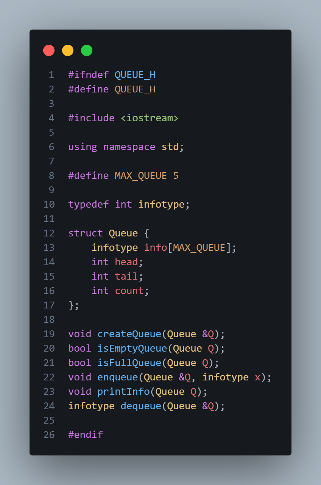
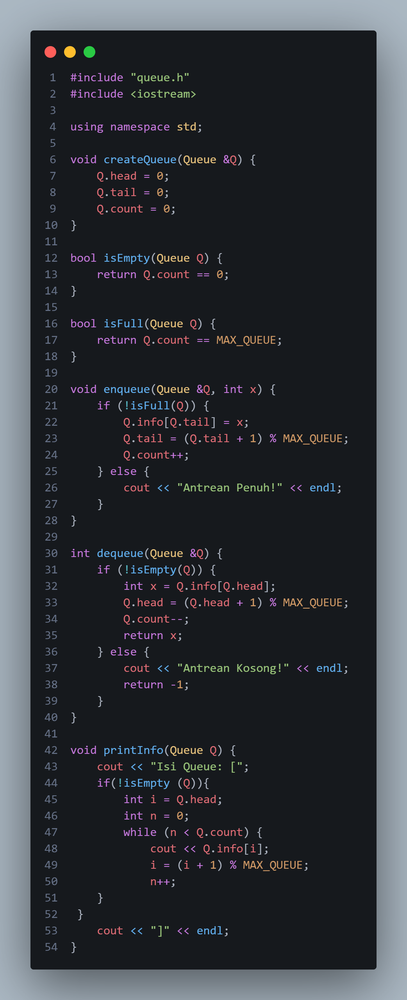
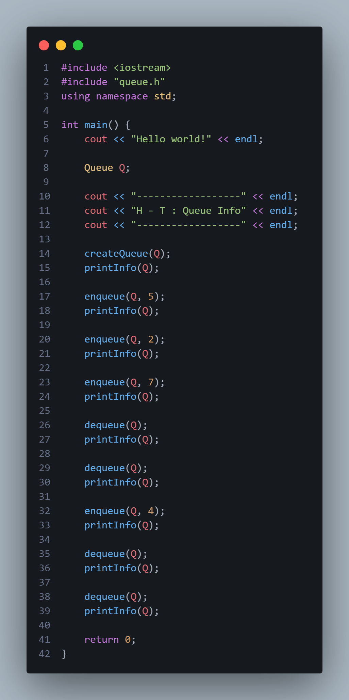
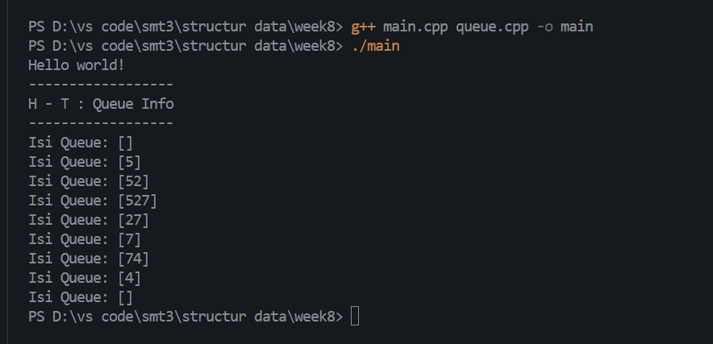
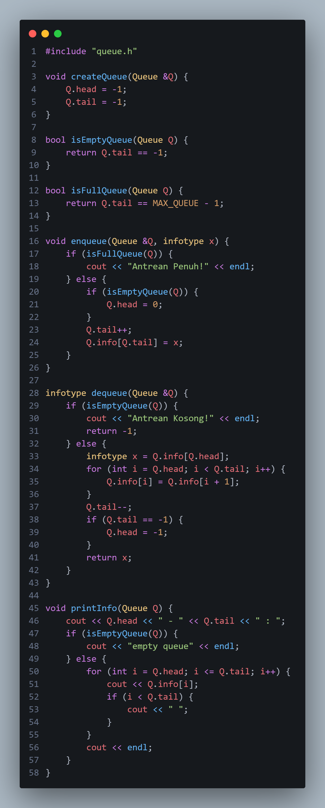
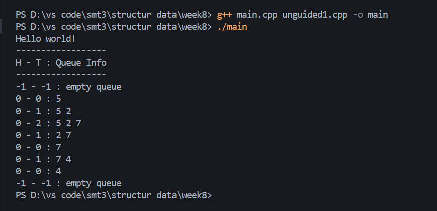
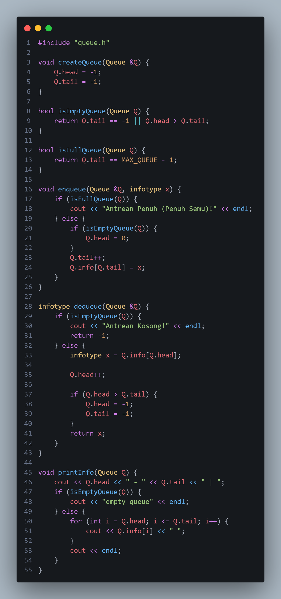
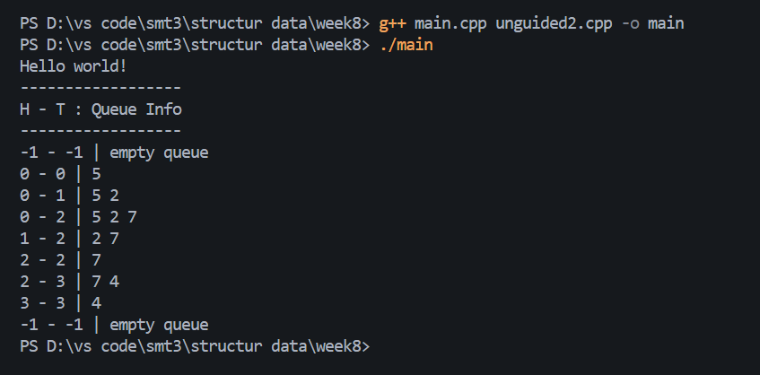
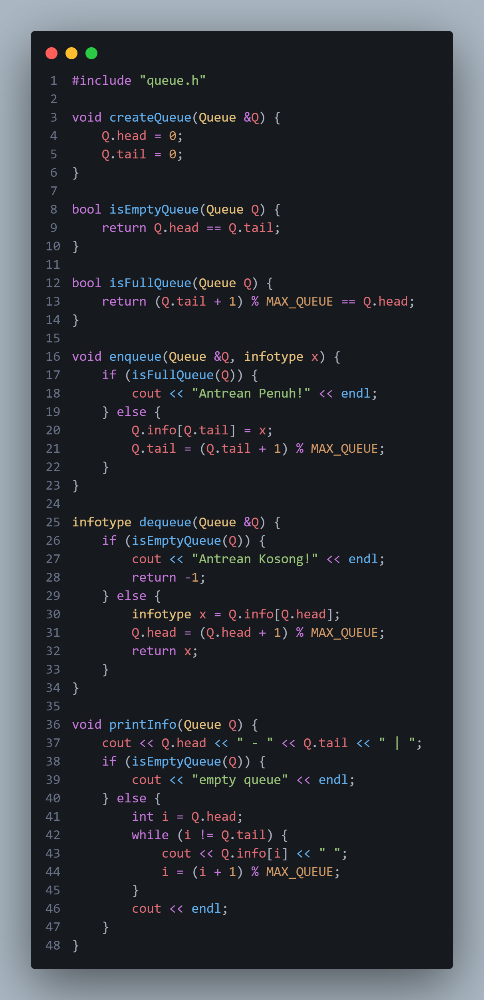
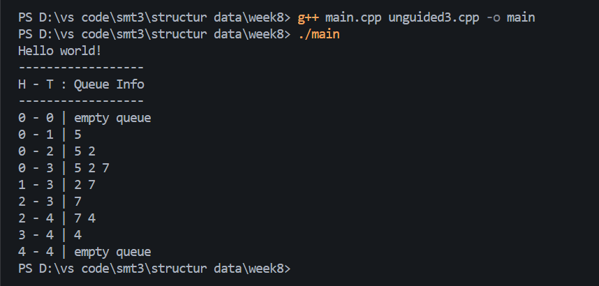

## 1. Nama, NIM, Kelas
- **Nama**: Trisna Kusuma Ramadhany
- **NIM**: 103112400277
- **Kelas**: 12 IF 05

## 2. Motivasi Belajar Struktur Data
[saya termotovasi di struktur data karena melatih berpikir logis Selain itu, penguasaan struktur data juga menjadi bekal berharga untuk menghadapi tantangan dunia kerja, karena hampir semua perusahaan IT menguji kemampuan ini dalam seleksi.]

## 3. Dasar Teoris,
Struktur data adalah cara untuk menyimpan dan mengelola data agar dapat digunakan secara efisien oleh komputer. Salah satu struktur data yang paling umum digunakan adalah queue, karena sangat cocok untuk situasi antrean atau pemrosesan data secara berurutan. Queue banyak dipakai pada sistem antrian layanan, manajemen proses di sistem operasi, buffer data, hingga simulasi antrian pada aplikasi.

- **Queue** adalah struktur data yang menerapkan prinsip FIFO (First In, First Out). Artinya, elemen yang pertama masuk ke dalam antrian akan menjadi elemen pertama yang keluar. Operasi dasar pada queue meliputi: a. enqueue() -> menambahkan elemen ke bagian belakang antrian. b. dequeue() -> menghapus elemen paling depan dari antrian. c. isEmpty() -> mengecek apakah antrian kosong. d. isFull() -> mengecek apakah antrian sudah penuh (untuk queue berbasis array). Konsep queue sangat sering digunakan dalam sistem nyata yang sifatnya “datang duluan dilayani duluan”, seperti antrean printer, penjadwalan proses, dan buffer multimedia.
- **Konsep Circular Queue**: adalah versi queue yang lebih efisien dibanding queue biasa karena indeks tail dapat “memutar” kembali ke indeks 0 ketika sudah mencapai batas array. Ini dicapai menggunakan operasi modulo (%). Contoh: tail = (tail + 1) % MAX_QUEUE Dengan cara ini, tidak ada proses penggeseran elemen saat dequeue, sehingga performanya lebih baik.

## 4. Guided
### 4.1 Guided 1

Penjelasan : file header queue.h yang berfungsi sebagai cetak biru untuk struktur data Antrean (Queue). File ini menetapkan ukuran antrean maksimal 5 elemen (MAX_QUEUE 5) dan membuat alias infotype untuk tipe data int. Intinya, ia mendefinisikan struct Queue yang berisi array info untuk menyimpan data, serta integer head dan tail untuk melacak posisi. Terakhir, file ini mendaftarkan semua prototipe fungsi (seperti createQueue, enqueue, dequeue, dll.) yang akan digunakan untuk memanipulasi antrean tersebut , sementara implementasi atau logika dari fungsi-fungsi itu akan ada di file .cpp terpisah.

### 4.2 Guided 2

Penjelasan : Kode ini merupakan implementasi queue menggunakan circular array. createQueue mengatur queue agar mulai kosong. isEmpty mengecek apakah queue kosong, dan isFull mengecek apakah queue penuh. Fungsi enqueue menambah data di posisi tail, lalu memajukan tail secara melingkar dan menambah count. Fungsi dequeue mengambil data dari posisi head, memajukan head secara melingkar, serta mengurangi count. Jika penuh atau kosong, muncul pesan peringatan. Fungsi printInfo menampilkan isi queue dari head sebanyak jumlah elemen. Semua proses mengikuti aturan FIFO (First In, First Out).

### 4.3 Guided 3

Penjelasan : Program tersebut berfungsi sebagai driver untuk menguji apakah struktur Queue yang kamu definisikan bekerja dengan benar. Pertama, program membuat sebuah objek Queue Q lalu memanggil createQueue(Q) untuk memastikan queue berada dalam kondisi awal yang konsisten, biasanya dengan head menunjuk ke posisi pertama, tail pada posisi awal, dan count bernilai nol. Setelah itu, setiap kali dilakukan operasi enqueue atau dequeue, program memanggil printInfo(Q) untuk menampilkan keadaan queue saat ini. Pola operasinya sengaja disusun secara bergantian—menambah, menghapus, lalu menambah lagi—karena tujuan utamanya bukan sekadar menampilkan isi queue, tetapi menguji apakah logika pengelolaan indeks head, tail, serta count benar-benar stabil. Jika queue diimplementasikan sebagai circular queue, maka program ini seharusnya tetap menampilkan hasil yang konsisten meskipun dilakukan beberapa kali perubahan posisi akibat operasi enqueue–dequeue berulang. Namun jika implementasinya linear atau ada kesalahan dalam pemutakhiran indeks, perilaku aneh seperti elemen tidak bergerak, indeks melewati batas array, atau queue “penuh” padahal masih ada ruang di depan akan langsung muncul. Dengan demikian, program main() ini berperan sebagai alat uji sederhana yang memverifikasi apakah fungsi queue yang kamu buat bekerja sebagaimana mestinya dalam berbagai kondisi penggunaan.

output :

## 5. Unguided
### 5.1 Unguided 1

Penjelasan : Program tersebut mengimplementasikan struktur data Queue (antrean) menggunakan array statis dengan metode head–tail shifting. Pada awalnya, fungsi createQueue digunakan untuk menginisialisasi antrean dengan memberikan nilai -1 pada variabel head dan tail, sebagai tanda bahwa antrean masih kosong. Untuk mengecek kondisi antrean, digunakan dua fungsi: isEmptyQueue, yang mengembalikan nilai benar jika tail == -1, menandakan tidak ada data; dan isFullQueue, yang memeriksa apakah tail sudah mencapai indeks maksimum array (MAX_QUEUE - 1), artinya antrean penuh.
Proses menambah data ke antrean dilakukan oleh fungsi enqueue. Jika antrean sudah penuh, program akan menampilkan pesan “Antrean Penuh!”. Namun jika masih ada ruang, data akan dimasukkan ke posisi setelah tail. Jika sebelumnya antrean kosong, maka head diubah menjadi 0 terlebih dahulu. Setelah itu, tail ditambah satu dan data baru disimpan pada indeks tersebut.
Untuk mengeluarkan data dari antrean, fungsi dequeue digunakan. Jika antrean kosong, fungsi akan memberi pesan “Antrean Kosong!” dan mengembalikan nilai -1. Jika tidak kosong, data pada posisi head diambil sebagai elemen yang keluar. Karena implementasi ini menggunakan array biasa, dilakukan pergeseran elemen ke kiri (shifting) untuk menjaga agar elemen terdepan selalu berada pada posisi indeks 0. Setelah shifting, tail dikurangi satu. Bila setelah penghapusan antrean menjadi kosong, maka head dan tail dikembalikan ke nilai -1.

output :

### 5.2 Unguided 2

Penjelasan : Program tersebut dengan  mengimplementasikan struktur data Queue (antrean) berbasis array dengan pendekatan linear queue tanpa shifting. Fungsi createQueue bertugas menginisialisasi antrean dengan memberikan nilai -1 pada head dan tail, yang menandakan bahwa antrean masih kosong. Untuk memeriksa kondisi antrean, digunakan dua fungsi yaitu isEmptyQueue dan isFullQueue. Fungsi isEmptyQueue mengembalikan nilai benar ketika tail == -1 atau ketika head telah melewati tail, yang berarti antrean tidak memiliki elemen lagi. Sementara itu, isFullQueue mengembalikan nilai benar jika tail sudah mencapai indeks maksimum array (MAX_QUEUE - 1), yang menunjukkan bahwa tidak ada lagi ruang untuk menambah data baru.
Proses memasukkan elemen baru dilakukan oleh fungsi enqueue. Jika antrean penuh, program menampilkan pesan “Antrean Penuh (Penuh Semu)!” karena pada linear queue, ruang yang sudah terpakai di bagian depan tidak dapat dipakai lagi meskipun kosong. Namun, jika masih ada ruang, fungsi memeriksa apakah antrean kosong; jika iya, head diatur ke indeks 0. Kemudian tail ditambah satu untuk menentukan posisi penyisipan berikutnya, dan nilai baru disimpan pada indeks tersebut.

output :

### 5.3 Unguided 3

Penjelasan : Program tersebut  menggunakan array statis. Berbeda dari queue linear biasa, circular queue memungkinkan elemen baru ditempatkan kembali ke awal array ketika posisi akhir sudah tercapai, sehingga ruang yang sudah terpakai dan kosong dapat dipakai ulang. Fungsi createQueue menginisialisasi antrean dengan mengatur nilai head dan tail ke 0, menandakan posisi awal antrean. Untuk memeriksa kondisi antrean, digunakan dua fungsi utama: isEmptyQueue, yang mengembalikan nilai benar ketika head dan tail berada pada posisi yang sama (artinya tidak ada elemen dalam antrean), dan isFullQueue, yang menghitung apakah posisi setelah tail—dengan operasi modulo agar melingkar—bertemu dengan head, menandakan bahwa tidak ada slot kosong lagi.

output :

## 6. Kesimpulan
 saya dapat menarik kesimpulan bahwa  melalui proses implementasi berbagai operasi dasar seperti enqueue, dequeue, isEmpty, isFull, serta printInfo, saya memperoleh pemahaman yang lebih mendalam tentang cara kerja struktur data ini dalam mengelola sekumpulan data secara teratur.Konsep utama yang menjadi dasar dari Queue adalah prinsip FIFO (First In, First Out), yaitu data yang pertama kali masuk akan menjadi data pertama yang keluar. Melalui praktik langsung, saya dapat melihat bagaimana aturan tersebut diterapkan secara nyata dalam program, sehingga memudahkan saya memahami alur masuk dan keluarnya elemen pada antrian. Hal ini sangat penting karena banyak proses dalam dunia nyata maupun dalam pemrograman yang menggunakan konsep FIFO, seperti pengelolaan tugas, sistem pelayanan, manajemen buffer, dan sebagainya.Selain itu, pada program ini juga diterapkan konsep circular queue, yang menawarkan keunggulan dibandingkan queue linear biasa. Circular queue memungkinkan penggunaan memori secara lebih efisien karena indeks akan berputar kembali ke awal ketika mencapai batas maksimal, sehingga tidak diperlukan pergeseran elemen secara manual. Hal ini membuat seluruh operasi pada queue dapat berjalan dengan lebih optimal, terutama ketika elemen terus ditambahkan dan dihapus secara berulang.Penerapan fungsi-fungsi yang terpisah untuk setiap operasi queue juga memberikan saya gambaran jelas mengenai pentingnya modularisasi dalam pemrograman. Dengan memisahkan logika berdasarkan fungsi tertentu, program menjadi lebih terstruktur, rapi, mudah dipahami, dan lebih mudah untuk dikembangkan atau diperbaiki. Pendekatan modular seperti ini merupakan praktik yang baik dalam rekayasa perangkat lunak, terutama dalam proyek berskala besar.

## 7. Referensi
1. GeeksforGeeks. “C++ Programming Language.” https://www.geeksforgeeks.org/c-plus-plus/
2. W3Schools. “C++ Tutorial.” https://www.w3schools.com/cpp/